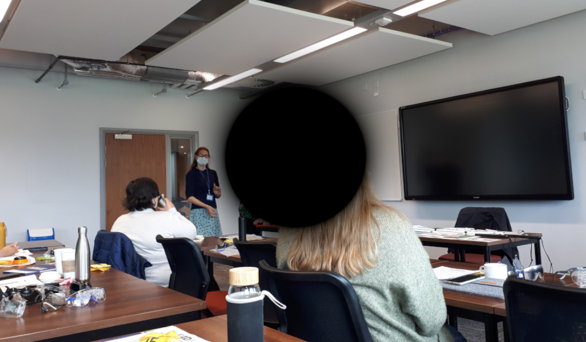
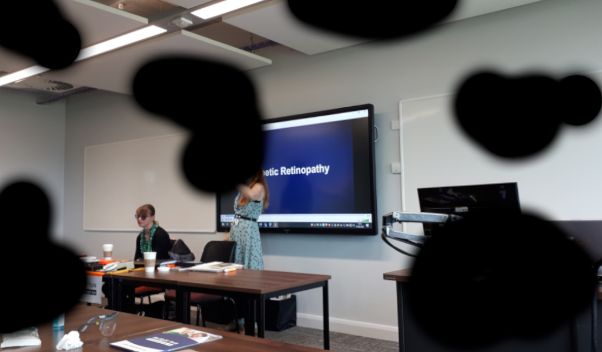
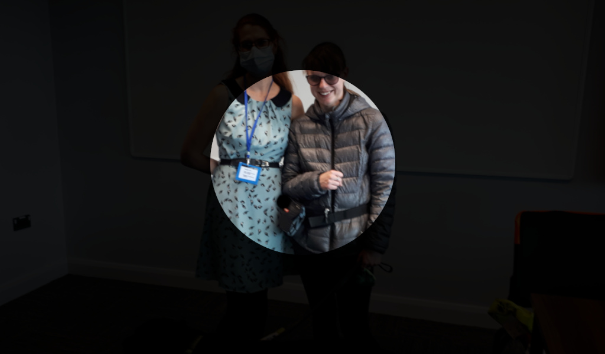
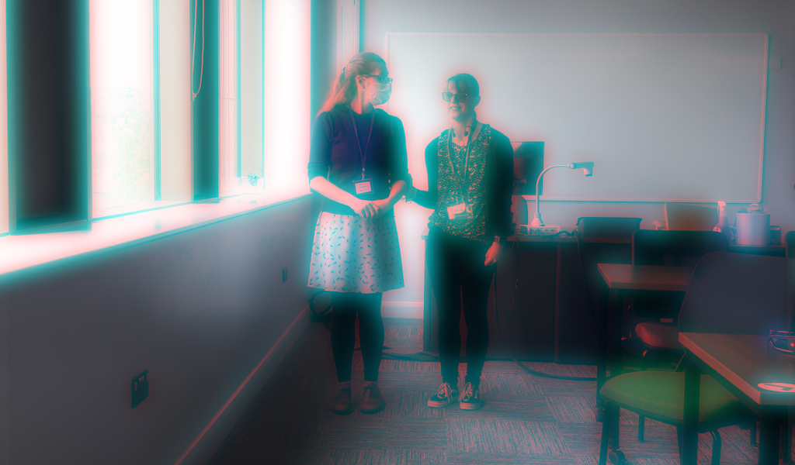

On Tuesday the 7th of June, our EAD team, along with eight other university members, attended a [MySight York](https://www.mysightyork.org/) Visually Impaired Awareness and Sighted Guiding Training. Our trainers were Community Involvement Officer Vicky Smith and Group Assistant Intern Jade Packering.

Since I had been working with Mariana and Gavin on the previous EAD project a few years ago, I had some insights on visual impairment. With a thorough introduction to the various types of visual impairments, a description of a typical day in the life of a blind person (Jade), advice on how to behave around guide dogs, and practical instruction on guiding inside and outside of buildings, the workshop was not only reviving but also deepened my understanding of the topic.

Vicky and Jade brought a set of simulation glasses so that we could more fully understand the various vision impairments. For instance, the age-related condition macular degeneration makes it challenging to read and recognise faces. The image below demonstrates how this syndrome makes centre vision worse.

Diabetic retinopathy, which is brought on by diabetes, is another disorder that affects eyesight. Reading and driving become challenging due to this illness since patches of vision loss emerge. See the example image below.

Glaucoma was the third condition we were able to experience thanks to the simulation glasses. This condition damages the optic nerves inside the eye, causing loss of peripheral vision, shown in the image below.

Another type of condition is cataract, which results in blurred vision. See the image demonstration below.

<!-- We were warned that this experience could be upsetting. -->

Our practical session in the afternoon involved sighted guiding, for which we teamed up with a partner. We were either blindfolded or wore one of the simulation glasses while our partners were ushering us around the room, through doors as well as up and down staircases.

It was a great day. Vicky and Jade put together a very interesting workshop that not only helped me learn something new about accessibility, but was also very fun and enjoyable! Thanks to Mariana, delicious food, including cakes and sandwiches that were all wrapped sustainably, was also served to us.

Krisztián

<!--

## Day 2
title: Roving Reporters Training Day
- DM5 and Zoom H1n, SD cards
- Michael running to get adapters
- sci-fi and thriller material
- task: 
    - A short interview
    - Intro – ambience – outro ( or a journey being diarized)  
    - Presenting – reading from a pre prepared script – created by themselves

Agenda: 
- 9am-9.30am Ice Breaker by MySight York 
- 9.30am-10.30am Introduction to EAD and Capturing Sound by k
- 10.30am-11.30am Presenting, Intros and Outros by Jane 
- 11.45am-12.45pm Practical skills for recording on the go by Jane 
- 1.15pm-3.15pm Practical session using equipment by k
- EAD Team to download files and listen back
- Listen back to recordings and session wrap 

-->