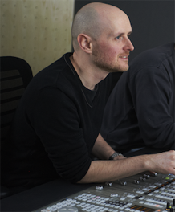
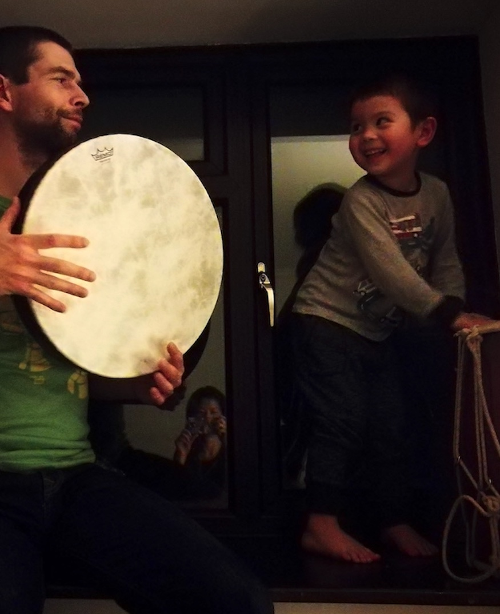

<!--
- ask for hi-res image of Gavin and public website?
- add new image for k
- add project advisory panel in responsive grid
-->

<head>

</head>

This page introduces the members of our <a href="#research-team">research team</a> and our <a href="#project-advisory-panel">project advisory panel</a>.

  

## Research Team
<!-- begin hero -->
<section class="hero">
  

    

      

      <h3>Dr Mariana Lopez</h3>
        

          

              

                <i>Principal Investigator</i>
                  
                Mariana Lopez is a Senior Lecturer in Sound Production and Post Production at the Department of Theatre, Film, Television and Interactive Media at University of York, where she has been working since 2016.
                  
                She has a background in music, sound design and acoustics. Her MA dissertation (University of York) focused on exploring the creation of a new format of sonic art entitled ‘audio film’ that may be considered as an alternative to Audio Description for visually impaired audiences.  In 2013 she completed her PhD at the University of York on the importance of virtual acoustics to further our understanding of medieval drama.
                  
                <a href = "mailto: mariana.lopez@york.ac.uk">mariana.lopez@york.ac.uk</a>
                 
                <a href="https://marianajlopez.com/">https://marianajlopez.com</a>
                

          

          

            

              
            

          

        

      

    

     

Click here for more info on Mariana.

 

She has a background in music, sound design and acoustics. Her MA dissertation (University of York) focused on exploring the creation of a new format of sonic art entitled ‘audio film’ that may be considered as an alternative to Audio Description for visually impaired audiences.  In 2013 she completed her PhD at the University of York on the importance of virtual acoustics to further our understanding of medieval drama.
  
Mariana is the Principal Investigator for the Arts and Humanities Research Council (AHRC) funded project ‘Enhancing Audio Description II: Implementing accessible, personalised and inclusive film and television experiences for visually impaired audiences.’ She was also the Principal Investigator for Enhancing Audio Description, also funded by the AHRC (2016-2018), and the British Academy funded project ‘The Soundscapes of the York Mystery Plays’. She has also supervised Marie Sklodowska-Curie Fellowships throughout the years, including the project 'Safe and Sound Drive: Design of a serious game for cars to help increase driver skills and lower fuel consumption' by <a href="https://www.ltu.se/staff/a/arny-1.11844?l=en">Dr Arne Nykänen‘s</a> and <a href="https://www.cathedralacoustics.com/">Dr Lidia Álvarez Morales'</a> work on 'Cathedral Acoustics. Sound as intangible heritage: preserving the acoustics of cathedrals in the United Kingdom'. She is currently supervising the project 'Acoustic Atlas: cultivating the capacity to listen' by <a href="https://www.acousticatlas.de/">Dr Cobi van Tonder.</a>
  
Mariana is also active in the field of sound design, having worked on a number of short films, theatre productions and other creative experiences.

  

</section>
<!-- end hero -->
 
<!-- begin hero -->
<section class="hero">
  

    

      

      <h3>Dr Gavin Kearney</h3>
        

          

              

                <i>Co-Investigator</i>
                  
                Gavin Kearney graduated from Dublin Institute of Technology in 2002 with an honors degree in Electronic Engineering and has since obtained both MSc and PhD degrees in Audio Signal Processing from Trinity College Dublin. During this time he worked (and continues to) in the audio industry as sound engineer and producer. After his PhD, he spent time as a postdoctoral research fellow in game audio on the Science Foundation Ireland ‘Metropolis’ project, whilst lecturing on the Interactive Digital Systems and Music and Media Technology courses at Trinity College. 
                  
                He first joined the University of York as a Lecturer in Sound Design at the Department of Theatre, Film and Television in January 2011 and has since been appointed as a Lecturer in Audio and Music Technology at the Department of Electronics. His research interests include spatial audio and surround sound, sound design for film, television and interactive media, real-time audio signal processing, Ambisonics and spherical acoustics, interactive audio systems, recording and audio post-production technique development.
                  
                <a href = "mailto: gavin.kearney@york.ac.uk">gavin.kearney@york.ac.uk</a>
                 
                <a href="https://pure.york.ac.uk/gavin.kearney">https://pure.york.ac.uk/gavin.kearney</a>
                

          

          

            

              
            

          

        

      

    

     

Click here for more info on Gavin (empty).

 

He has a 

  

</section>
<!-- end hero -->
 
<!-- begin hero -->
<section class="hero">
  

    

      

      <h3>Krisztián Hofstädter</h3>
        

          

              

                <i>Post-Doctoral Research Assistant</i>
                  
                Krisztián is a creative technologist working as a researcher, lecturer, freelancer and artist. Besides working on the Enhancing Audio Description project as a research assistant, his doctoral research developed brain-computer music interfaces for meditation, in which neurofeedback is linked to auditory entrainment in generative soundscapes inspired by shamanic journeying. 
                  
                He has also been teaching music technology-related subjects (e.g. sonic art, sensor technology and music for the moving image) as an associate lecturer at the Anglia Ruskin University, Cambridge and the University of Bedfordshire and currently teaches a module on sensemaking, digital identities and web-design at the School of Philosophy and Arts History at the University of Essex. As a freelancer and artist, he has been producing sound design and music, websites and visual art, including photography and paintings.
                  
                <a href = "mailto: krisztian.hofstadter@york.ac.uk">krisztian.hofstadter@york.ac.uk</a>
                 
                <a href=" https://khofstadter.com/"> https://khofstadter.com/</a>
                

          

          

            

              
            

          

        

      

    

     

Click here for more info on Gavin (empty).

 

He has a 

  

</section>
<!-- end hero -->

## Project Advisory Panel
