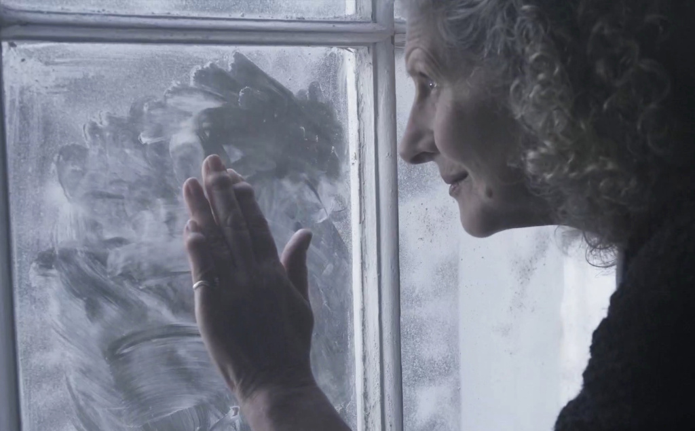

We are pleased to announce that we received 127 responses to our survey! Huge thanks to all our volunteers and special thanks to all the organisations that helped us disseminate the survey.

We held 8 focus groups as part of the project, 4 in Cambridge and 4 in York, and we welcomed 42 people who were invited to discuss our case study and gave us invaluable feedback on how to make it accessible. The focus groups in Cambridge wouldn’t have been possible without the help of Warren Wilson and Jerry Gilbert at [Cam Sight](https://www.camsight.org.uk/) and we are very grateful to the support provided by the [York Blind and Partially Sighted Society](https://www.mysightyork.org/),who allowed us to use their premises to conduct the meetings, as well as helping us recruit participants.

We are working on reading through all the feedback and we will publish updates as soon as possible!

