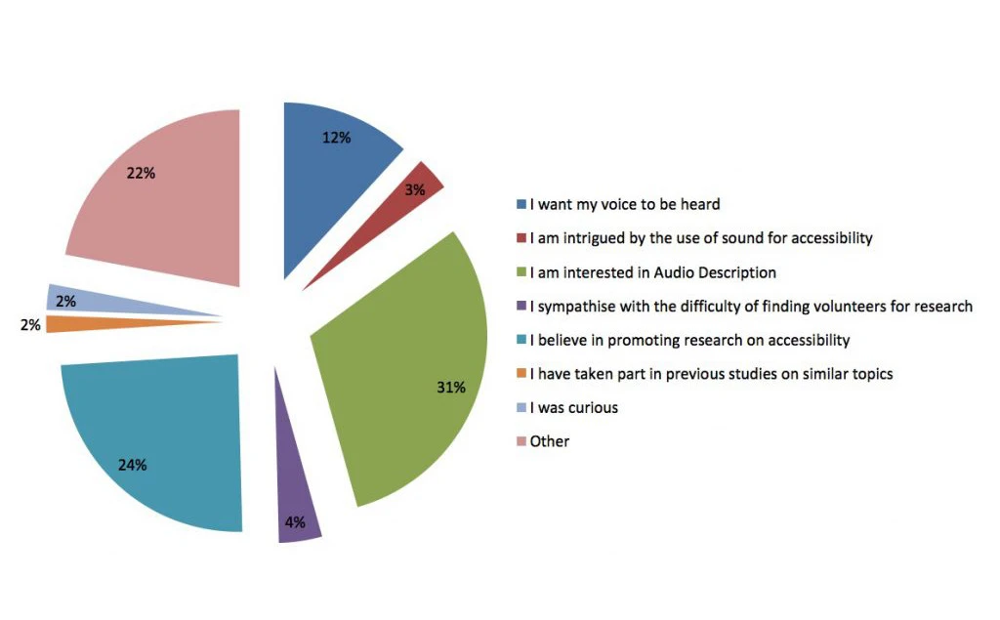
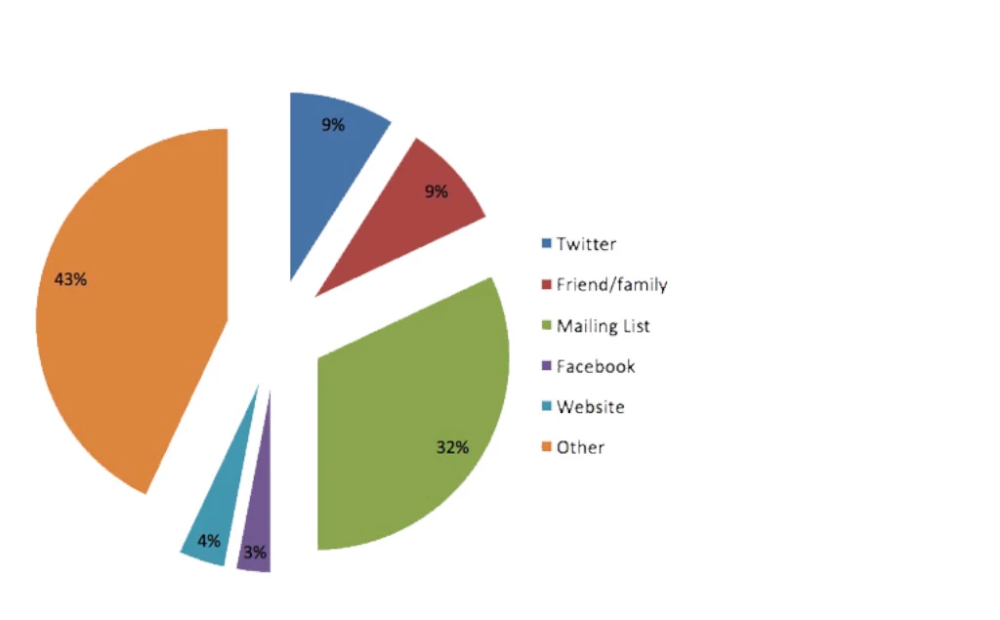

32% of our participants found out about the survey by email, which was sent to and distributed by different groups and individuals. Over 30% of our participants heard about the survey through a charity. Huge thanks to all the groups and organisations that helped us disseminate the call for participants, here are some of them:

- [Braille Chess Association](https://braillechess.org.uk/)
- [Cambridge Talking News](http://www.cambridgetalkingnews.org.uk/)
- [CamSight](https://www.camsight.org.uk/)
- [Eastbourne Blind Society](https://www.eastbourneblindsociety.org.uk/)
- [Goalball UK](https://goalballuk.com/)
- [Hertfordshire Society for the Blind](https://www.charitychoice.co.uk/hertfordshire-society-for-the-blind-1487)
- [Huntingdonshire Society for the Blind](http://huntsblind.co.uk/)
- [InfoSound](http://infosound.org.uk/)
- [Kent Association for the Blind](http://www.kab.org.uk/)
- [Lincoln and Lindsey Blind Society](https://www.llbs.co.uk/)
- [NFBUK](https://www.nfbuk.org/)
- [Norfolk and Norwich Association for the Blind](https://www.visionnorfolk.org.uk/)
- [Pocklington Trust](https://www.pocklington-trust.org.uk/)
- [RNIB](https://www.rnib.org.uk/)
- [Sandwell Visually Impaired](https://sandwellvisuallyimpaired.org.uk/)
- [SELVIS](http://selvis.org.uk/)
- [Sight for Surrey](https://sightforsurrey.org.uk/)
- [Sight Support Ryedale](https://sightsupportryedale.org/)
- [Talking Newspaper Federation](https://tnf.org.uk/)
- [The Accessible Friends Network](https://www.tafn.org.uk/)
- [The Haringey Phoenix Group](http://haringeyphoenix.org.uk/)
- [The Visually Impaired Social Club Leeds](https://www.facebook.com/groups/620036958194929/)
- [VISTA](https://www.vistablind.org.uk/)
- [York Blind and Partially Sighted Society](https://www.mysightyork.org/)

31% of our participants told us that their primary motivation for taking part in the survey was their interest in Audio Description, and 24% indicated they participated because they believe in promoting research on accessibility. For 12% of those who took part, our survey gave them the opportunity for their voice to be heard. With these reasons in mind, and overwhelming 83% of participants said they were happy to be contacted in the future.

Thanks to all those who took part in the survey! We’re committed to involving the end user in our research and these results have been invaluable to understanding user perspectives on the current state of Audio Description as well as the potential for future improvements.  Once more thank you very much to everyone who participated!

Morgan French