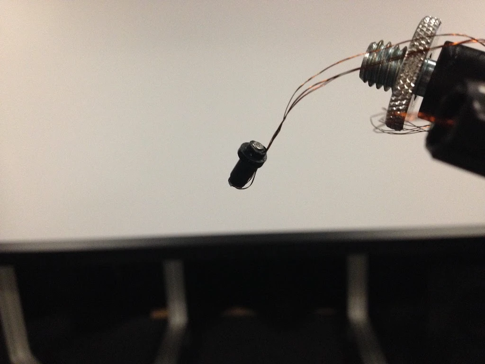
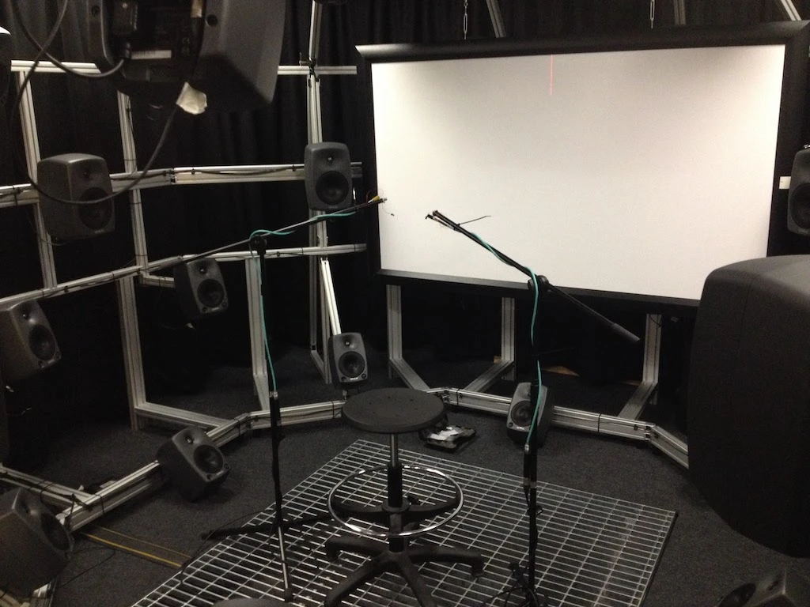
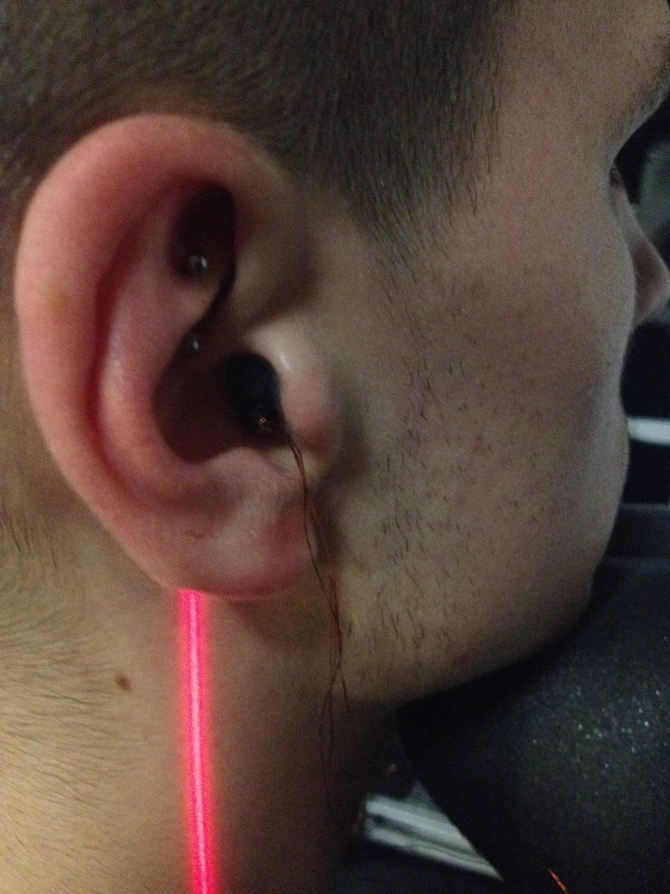
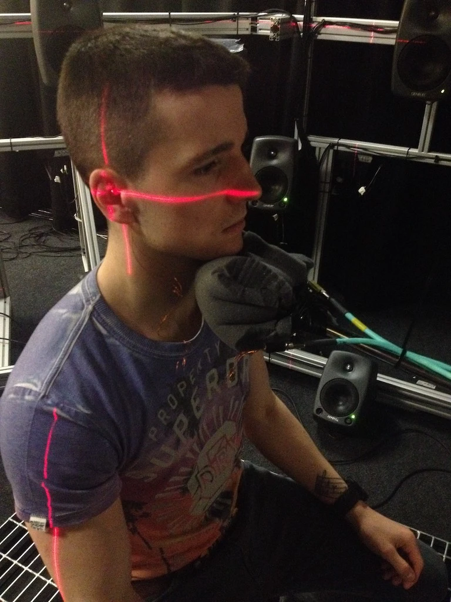
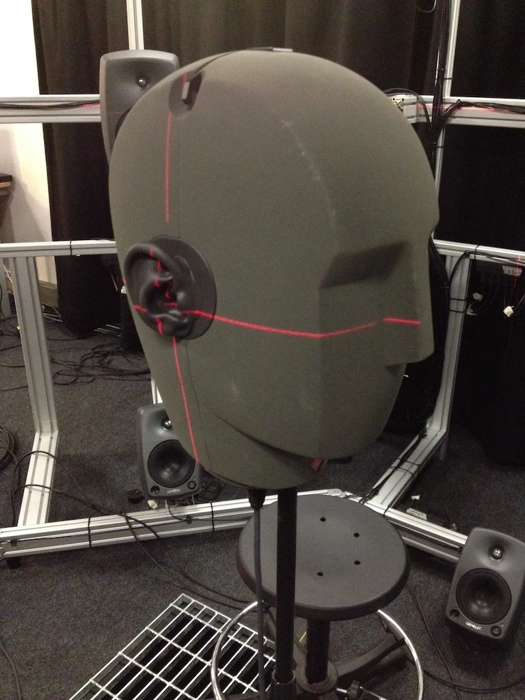

>I found the Enhanced Audio Description Tests a fascinating project to be a part of. Being able to hear how future technology could be adapted to become part of our everyday listening experience and also to try out, test and mould how this system could work to the best of its functionality. I was particularly impressed by the way sound could be produced and made to move from different directions around myself just by using a pair of earphones. ~ Nigel Minnett
  

The listening tests were split into three sections:

 

## 1 – Measurement
In order to produce accurate 3D audio over headphones, we need to know how listeners normally pick up sounds. We can gather this information by placing small microphones in the ears of the listeners and playing sounds from surround speakers around their heads. For these initial measurements we used a computer generated signal, a sweep going from low to high frequencies. This signal is played over a surround sound system with fifty different speakers located around the participants. For each sound, the small binaural microphones record the Head Related Transfer Functions (HRTF). These HRTFs are important as they are different to every person due to our heads and ears having different sizes and shapes.

 

## 2 – Verification Test
To make sure our measurements were correct, we ran a Sound Source Localisation and a Room Size Estimation verification tests. In both tests we played sounds through the surround system as well as headphones. In the first test the participants were asked to turn their heads towards the location of sounds with head-tracking devices recording their head movements. In the second test, the participants were asked to listen to a recording of a person reading. This recorded sound was played to the participants with different reverb adjustments. The HRTF measurements are verified if data in both tests done with the surround system and the headphone systems show similar results.

 

## 3 – Perception Tests
In the last section of the experiment, we conducted two tests; the Spatial Discrimination and Distance Perception tests using the headphone system.

In the Spatial Discrimination test participants were asked to identify the number of people talking on a recording. In a mono mix all characters sound as if they were coming from one speaker in front of the listener, in a slightly spread out mix characters sounded as though they were being played over a set of stereo speakers and in a widely spread out mix listeners felt they were in the middle of the scene i.e. in between the talking characters. The aim of this test was to identify which mixing method was the most informative regarding character identification.

In the Distance Perception test, we assessed whether a change in distance can be perceived when the reverb is altered and mixed differently. In the real world, if someone walks further away from us, his/her voice will become quieter. However, in film and television, in order to keep characters intelligible, the fact that they are far away from the camera is sometimes ignored and they are made to sound just as loud as they would when they are closer to the camera. This has the potential to misinform listeners regarding the distance of characters in a scene.

Participants in our test were asked to listen to a character reading text. As the character spoke, they would either remain in their position, move towards the participant, move away from the participant or a combination of both. The participants were asked to state how many times they thought the character had moved. The volunteers were asked to listen to speech extracts sixty times, with each trial using a different direct sound to reverb ratio as well as different combinations of movement.

> It was great to take part in the listening test. It was very well organised by Mariana and Lewis and everyone was very welcoming. It was a great set up and a fascinating test. I found it much easier with the headphones to determine the locations of the sound. Audio description services lag far beyond those of subtitles so this project is vital to the progress of audio description. A very worthwhile project and more are much needed like this. Well done to everyone involved at the University of York. ~ Paul Millross

Now, we are analysing our data…

Krisztian and Lewis

