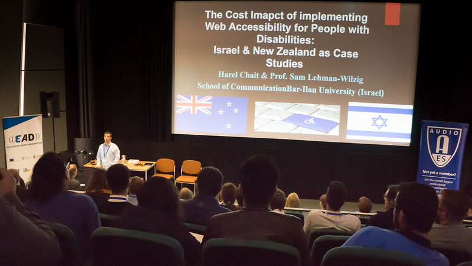

*How did you first become interested in accessibility?*

As a person who is visually impaired, I’ve always been interested in how society can integrate people with disabilities and give them the ability to contribute instead of rejecting them. These days, the modern technology and the Internet enable them to maximise their potential of integration into society more than ever before. But to what extent does that happen? That’s my central research question.

*What surprised you most in you work practice?*

The challenge of implementing web accessibility for people with disabilities, and the lack of knowledge and awareness about it in the web experts’ community — especially about how to improve their websites.

*Are there any restrictions or boundaries you (have to) abide by?*

The standard of making an accessible website is called “Web Content Accessibility Guidelines 2.0” that only includes principles of web accessibility but not ways of implementing them. Therefore, every web expert has his/her own way of building an accessible website. Consequently, how does the regulator know what the accessible and inaccessible websites are for people with disabilities?

*What do you hope to achieve through your work?*

Helping policymakers determine how much to demand of webmasters etc when working on disability access. If the cost is too great, that might prevent people from establishing a website altogether — not something a society (or the regulator) wants to happen.

*Can you tell us a little about you forthcoming projects (related to accessibility)?*

I would like to understand what people with disabilities really need when browsing the web and how to make it easier for society to establish more accessible websites.

 

Harel took part in our [conference](conference-on-accessibility-in-film-television-and-interactive-media) in 2017.

 

