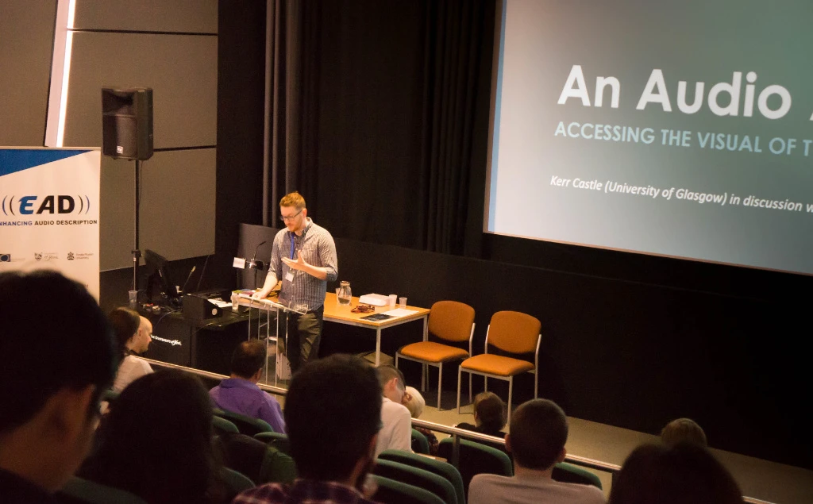

*How did you first become interested in accessibility?*

So, I used to work in Access Services at Ericsson Broadcast and Media Services in Glasgow (formerly Red Bee Media). I was a subtitler there for around a year (2014-15), latterly working on live output for the BBC and Channel 4. Requiring a very particular skillset – essentially, re-speaking and live editing content as you’re saying it – it was an amazing job and it really introduced me to various issues concerning accessibility for hard of hearing (HOH) audiences and TV viewers with visual impairments. When I returned to university and started my PhD towards the end of 2015, my focus on comfort and television, thinking about the potential therapeutic role of television in daily life, also allowed me to briefly return to the work of access services and, specifically, the translation of TV by audio describers.

*What surprised you most in your work practice?*

What has been great for myself with this paper is that I’m not an audio describer. Having worked in access services, I’m fully aware of the differing needs of viewers and how to best communicate aural content, but audio description was something that had always interested me and, arguably, there’s a lot more going on in that audiovisual translation (AVT) of television; not just replicating somebody else’s speech, but describing the setting they are in, their actions, their emotions, and so forth. The interviews I conducted with a current AVT practitioner, Jonathan Penny, were incredibly insightful and revealed a level of detail in this work that I had not fully appreciated. What I intend to present at the conference is a unique combination of practitioner and academic perspectives, and how we might reposition our understanding of the audio described television text.

*Are there any restrictions or boundaries you (have to) abide by?*

Again, my work subtitling in access services was highly structured and you had to adhere to certain procedures and guidelines, and the same equally applies to audio describers. However, from personal experience, and from the AVT practitioner interviews, the main aim is really to just ensure the best experience possible for the end user; for the access services element of their consumption to enhance their viewing, rather than draw attention to itself and detract from the original content.

*What do you hope to achieve through your work?*

As mentioned above, the principle focus of my PhD is comfort and television – an empirical study developed and carried out with the approval of the NHS – so this work around audio description and the value of this kind of televisual experience is not directly a part of my main research. However, access services is something that continues to fascinate me and an area of study that I am keen to return to at greater length in the future. Equally, the Comfort TV Research Project does examine aspects of TV consumption, such as viewing environment, the sociality of television, discomfort, and so forth, which might also yield relevant data for audio describers.

*Can you tell us a little about your forthcoming projects (related to accessibility)?*

I recently presented a paper at the Screen Studies Conference (23/06/17-25/06/17) which considered how a sense of place can make TV comforting. I’m also looking at getting a version of my audio description paper published as part of an edited collection on discourses of care.

  

## EAD Podcast 05
Listen to Kerr's presentation at out [Accessibility in Film Television and Interactive Media Conference](/conference-on-accessibility-in-film-television-and-interactive-media/) with the audio player below. 

 

<iframe title="EAD podcast 05." width="100%" height="20" scrolling="no" frameborder="no" src="https://w.soundcloud.com/player/?url=https%3A//api.soundcloud.com/tracks/372529187&amp;color=daa95f&amp;inverse=false&amp;auto_false=true&amp;show_user=true"></iframe>

 

We are currently transcribing this podcast.

 

