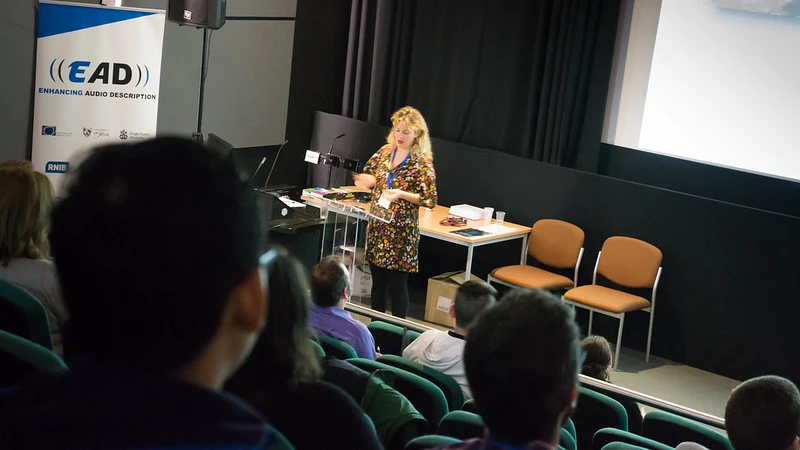

*How did you first become interested in accessibility?*

M Olalla Luque: I was studying a year abroad in London and I was very surprised to see groups of disabled people walking around the arts museums! There wasn’t such a thing in Spain! Then, I was the luckiest person when I discovered there was a research group in my own university, back in Granada, specialised in audio description of films, TRACCE. I couldn’t believe it. I started working with them when I met them!

Silvia Soler: In my case, accessibility found me. I had just finished my MA thesis on Chinese-Spanish dubbing, and my advisor offered me the possibility to join the research team she belonged to, which specialised in film audio description. The research team coordinator gave me a list with the most relevant bibliography in the field and some time to read and make a decision. I found audio description a fascinating translation modality with great social implications, and I decided to combine my work as full-time translator with a PhD in audio description.

*What surprised you most in you work practice?*

M O and S: Absolutely everything can be a nice surprise when you work with people. When we started to collaborate with organisations of people with a visual impairment and museums to offer guided tours with audio description, it was surprising to get to know the many different needs and expectations among visually impaired people. We realised that the personal context of each visually impaired visitor had a great impact on how they perceived the audio descriptions we created for the guided tours. Sometimes they are not used to going to museums or watching a film with audio description, so their reactions are amazing.

*Are there any restrictions or boundaries you (have to) abide by?*

M O and S: Accessibility should be considered a catalyst for change in our society, but we often face a lack of understanding of the importance of a good accessibility to the arts for all. Also, the lack of money is a constant difficulty we encounter. Accessibility and the arts? No way some people are willing spend money and time on us (on all!). Finally, the production schedule to create an audio descriptive guide is often too tight, which makes it difficult to involve visually impaired consultants in the project.

*What do you hope to achieve through your work?*

M O and S: We hope our research leads to an enhancement of the ways audio description is created and performed. We have to make everything easier so that museums, companies and governments pull for these communities! We also hope we can contribute to make life happier and artier for some people. And we hope we can be happier too by doing this.

*Can you tell us a little about you forthcoming projects (related to accessibility)?*

M O: We are currently working with several museums in Spain, apart from our research work. The Alhambra, Sorolla Museum, Science Park in Granada, and CajaGRANADA museum are our current collaborators. We design and offer guided tours and workshops for these institutions, and we are willing to jump to other museums.

On the research side, we continue to carry out descriptive studies of audio description in art museums, in which we analyse existing audio descriptions and interview organisations, companies and museum educators involved in the creation of and provision of audio descriptions. The goal of these studies is to reflect on the way audio description is done in art museums nowadays from a sociological and linguistic perspective and to propose alternatives, as well as to create theoretical and methodological tools that can be used by trainers in this field.

 

María took part in our [conference](conference-on-accessibility-in-film-television-and-interactive-media) in 2017.

