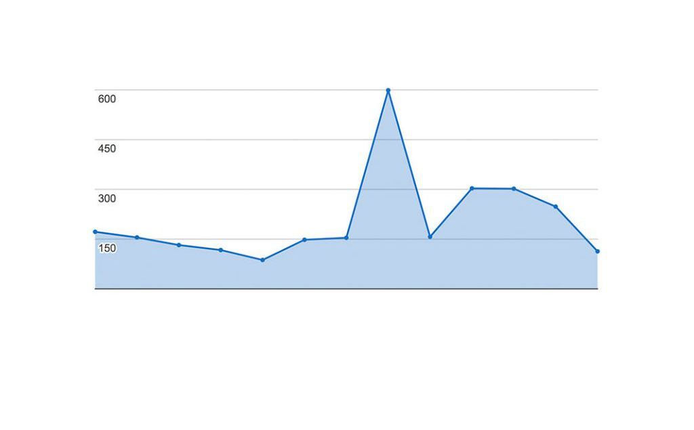
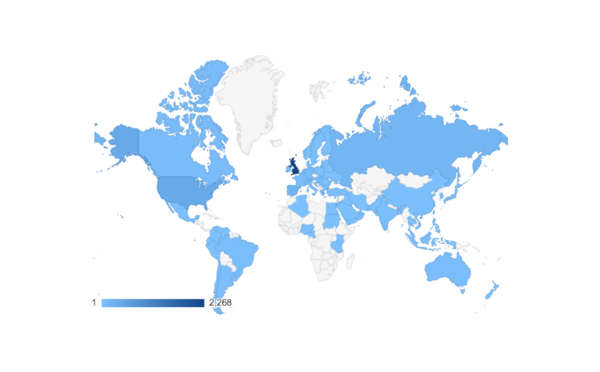
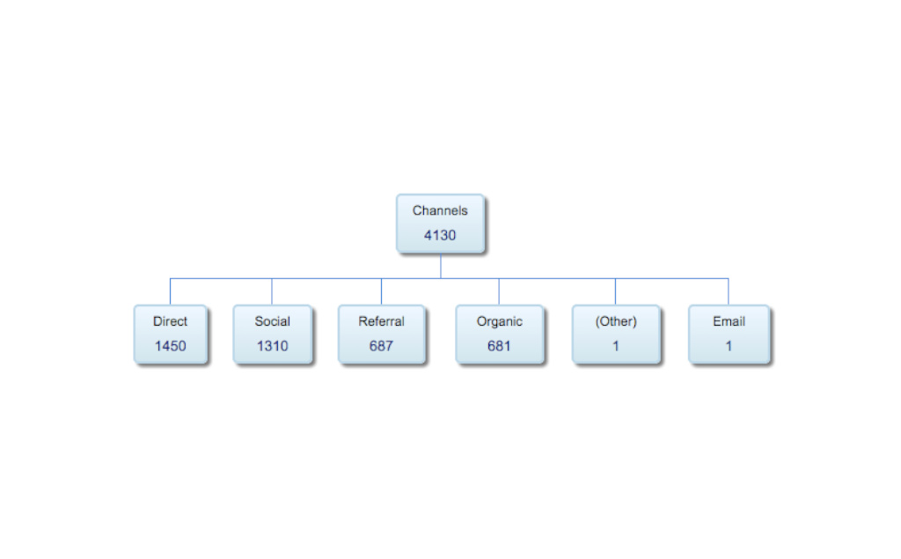

Since we launched our project in April 2016 we have had over 127,440 visits to this website from over 80 countries, most from the UK and the US. 31.7% of our visitors found this website through social media, 16.6% from referrals (which is when a link to our website is found on another website) and 16.4% by organic searches, which is when for instance search engines like google.com find our website with keywords.

We are thrilled that the interest in our project is growing and we hope to continue raising awareness on Audio Description and inclusivity in the coming months.

Thanks!

The EAD team

 

Photo of balloons by <a href="https://unsplash.com/@adigold1?utm_source=unsplash&utm_medium=referral&utm_content=creditCopyText">Adi Goldstein</a> on <a href="https://unsplash.com/s/photos/birthday?utm_source=unsplash&utm_medium=referral&utm_content=creditCopyText">Unsplash</a>
  