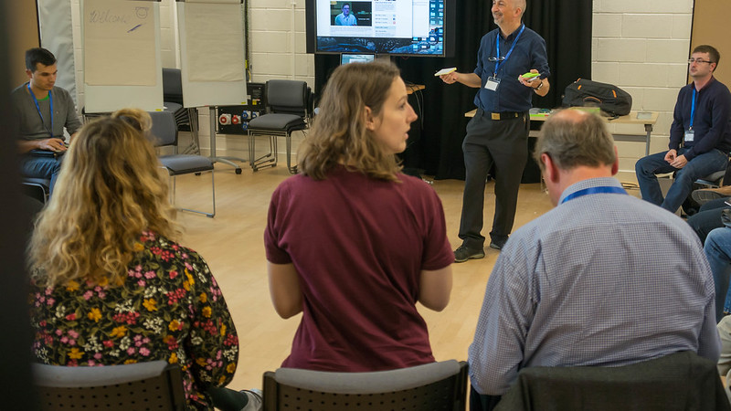

*How did you first become interested in accessibility?*

I was given the task of working on signing on arrival at BBC R&D.

*What surprised you most in your work practice?*

The poor quality of much of the research on accessibility.

*Are there any restrictions or boundaries you (have to) abide by?*

Budgets, available effort and politics.

*What do you hope to achieve through your work?*

Improved services for our audience.

*Can you tell us a little about you forthcoming projects (related to accessibility)?*

Nothing planned at the moment.

 

Mike took part in our [conference](conference-on-accessibility-in-film-television-and-interactive-media) in 2017.

 

