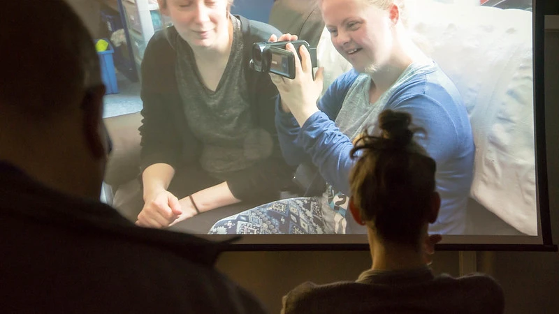

*How did you first become interested in accessibility?*

I started work as a teaching assistant at a SEN school in 2005 and it wasn’t until that point that I really understood the reality of the challenges that people face in terms of accessibility. This has influenced much of the work I have done since, which has dealt with accessibility in different ways.

*What surprised you most in your work practice?*

I’m currently working on the Accessible Film Project, which is the practice element of my research. The project has been designed and delivered in collaboration with the charity Sense, the leading national charity that campaign and support people who are to some extent both deaf and blind.

We’ve held courses of filmmaking workshops with people with sensory impairments at Sense Resource Centres across the UK. The workshops are participant-led, so although we had an original plan, we responded to each individual’s needs and adapted our plan throughout the sessions. This always surprises me! We had the same starting point for each course of workshops, but all of them have developed in such different ways.

*Are there any restrictions or boundaries you (have to) abide by?*

The boundaries we have faced have helped to refine and develop the research and practice. These challenges mainly relate to time constraints, communication issues and access to creation, content and space.

*What do you hope to achieve through your work?*

With regards to the Accessible Film Project, we hope to create a model that can be used widely: to create more creative opportunities in film for people with sensory impairments; to improve access from pre-production through to distribution, also including the viewing experience of audiovisual media; to raise awareness and promote diversity on and off screen. 

*Can you tell us a little about your forthcoming projects (related to accessibility)?*

I’m really excited about the documentary that I’m currently working on for my thesis. It will bring all the research together and is an opportunity for the participants to showcase their work and share their filmmaking experience with as wide an audience as possible.

 

Kate also took part in our [conference](conference-on-accessibility-in-film-television-and-interactive-media) in 2017.

 

