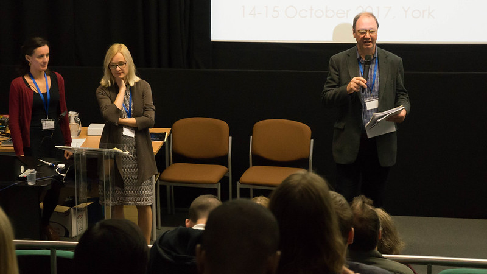

*How did you first become interested in accessibility?*

As a software engineering graduate looking for a worthwhile field of work, I was offered the chance to take part in a research and development project aimed at making TV subtitling a reality in the UK. At the time, the equipment was incredibly expensive and cumbersome, and my job was to make it fast and efficient. I soon found just how fascinating it was to support a creative and “artistic” process with technology in such a way that the person and the computer contributed their complementary skills and capabilities in a shared endeavour.

*What surprised you most in your work practice?*

I was surprised at how rich this field is: it sounds easy to say “oh, just stick some texts on the screen”, but when you start to explore the cognitive challenges of conveying sound and pictures using just pictures and text in a way which delivers the same appreciation and understanding, it can be really challenging. Providing perfect access services for truly live broadcast events is impossible since there is so little time to produce anything: it then becomes a challenge to see just how good a service can be made using the very best of human skill and the very latest technology.

*Are there any restrictions or boundaries you (have to) abide by?*

The boundaries for the provision of access services are often commercial: there’s always a trade-off between what could be done and what will be funded. For example, there’s a case to be made that two levels of subtitling might be beneficial since the spectrum of potential users ranges from prelingually profoundly deaf people to those who have become hard-of-hearing later in life. But at present, there are no budgets to support this, and so it’s always a matter of working within the boundaries of what is practical whilst seeking to push those boundaries as far as possible.

*What do you hope to achieve through your work?*

Developing the tools and techniques for access services, particularly in the field of subtitling, has pretty much been my career. It’s only when you look back on the progress which has been made – in the UK, channels such as the BBC offering 100% access through subtitles – that you realise what has been achieved in the last 30 years. Day to day you’re just focused on the next challenge. There’s still more to do, and my touchstone has always been that we should preserve quality and respect the skills of those who create access services, at the same time as increasing the availability.

*Can you tell us a little about your forthcoming projects (related to accessibility)?*

I’m focused on the challenges of how the remaining errors in real-time subtitling services can be reduced by moving live speech recognition systems towards genuinely having “Artificial Intelligence” rather than just giving the impression of having intelligence because they appear to understand what we are saying. In fact, they don’t understand it in the least, and that’s the biggest part of the problem. 

  

Andrew also took part in our [conference](conference-on-accessibility-in-film-television-and-interactive-media) in 2017.

 

