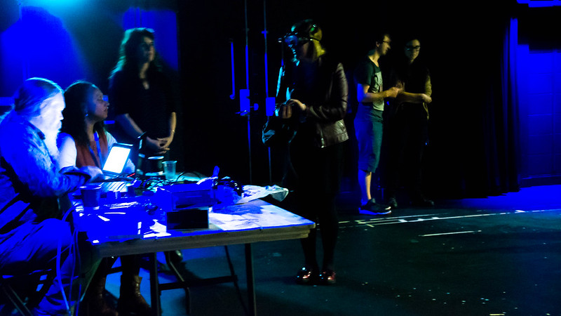

<iframe title="audio player" width="100%" height="20" scrolling="no" frameborder="no" src="https://w.soundcloud.com/player/?url=https%3A//api.soundcloud.com/tracks/386396861&amp;color=daa95f&amp;inverse=false&amp;auto_false=true&amp;show_user=true"></iframe>

 

We are currently transcibing this podcast.

 

Visit our [conference page](/conference-on-accessibility-in-film-television-and-interactive-media) for more information.

 
