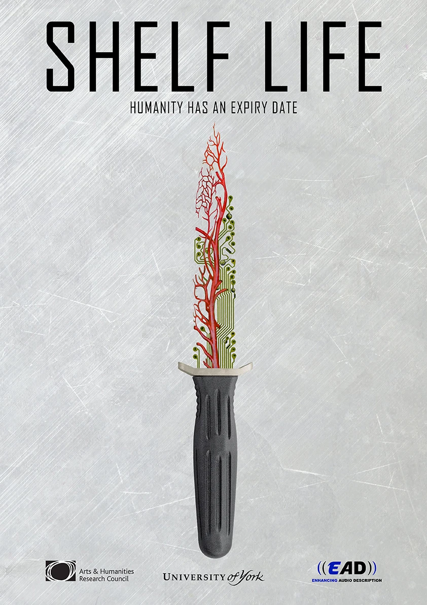
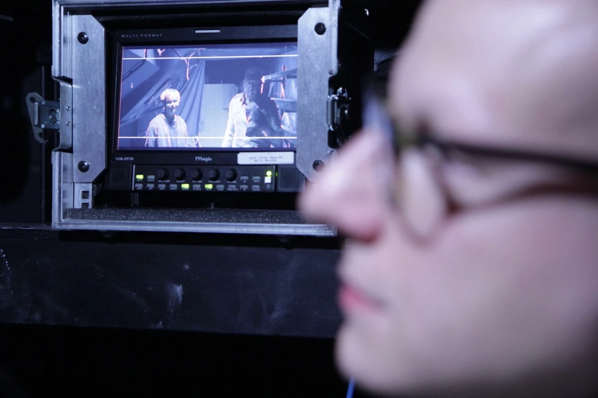
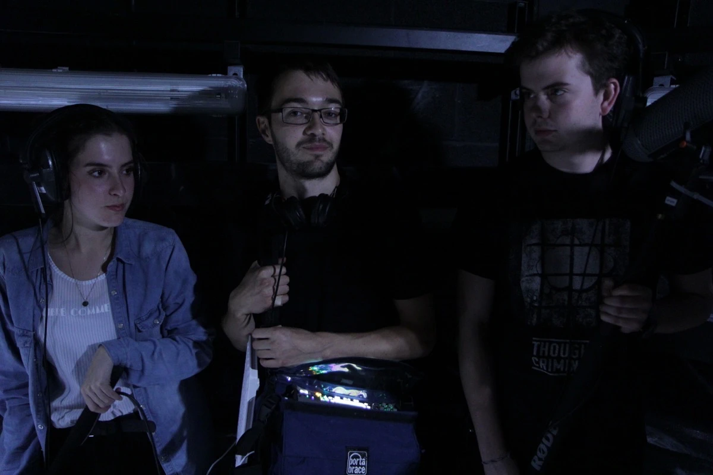

A big part of our research on Enhancing Audio Description focuses on how digital production and postproduction workflows can be modified to allow for accessibility to be incorporated from the start of the filmmaking process.  In order to test our guidelines, we hired 20 students from the [Department of Theatre, Film and Television](https://www.york.ac.uk/tfti/), at the University of York.  Students came from a variety of programmes including the BSc in Film and Television Production, the MA/MSc in Postproduction with Sound Design, the MA/MSc in Postproduction with Visual Effects and the MA in Digital Film and TV Production.

The filmmakers were given the challenge of creating a film in 4 weeks and asked to consider the scripting of the first person narration, the use of additional sound effects and the use of audio spatialisation for accessibility from the very start of the creative process.

A key part of making this film was introducing students to the thought of accessibility as a creative process and as something that could be intrinsic to their films.  We hope that our students go on to become wonderful professional filmmakers that consider diversity as a key part of their work.  By training students today we hope to create a better future that explores the potential of sound design for accessibility in the context of the creative industries.

‘Shelf Life’ premieres in Hamburg in June 2018 as part of the [Klingt Gut Sound Symposium](https://klangsymposium.sched.com/).

The students that participated as part of the project were

Director – Gianluca Balla
Writer – Bethany White
Producer – Emily Thornhill
Director of Photography – Will Firth
Stavros Ladikos – Editor
Make-up – Camilla Boldrin
Costume Design – Emma Whitworth and Camilla Boldrin
Set Design  – Georgie Hook and Roxanne Spence
Production and Post-Production Recording – Ewan Marshall-Atherton and Lily Hambly
Sound Editor – Márton Bajczi
Dubbing Mixer  – Patrick Nichols
1st Assistant Camera  – Finbar Somers
2nd Assistant Camera  – Ben Hewitt
Tobías Palma – Gaffer/Electrician

Additional Crew:
Zenely Martin Rios
Kaloyan Deyanov
Joshua Denby
Evie Brudenall

Poster Designer – [Bianca Cassinelli](http://www.biancacassinelli.com/)

