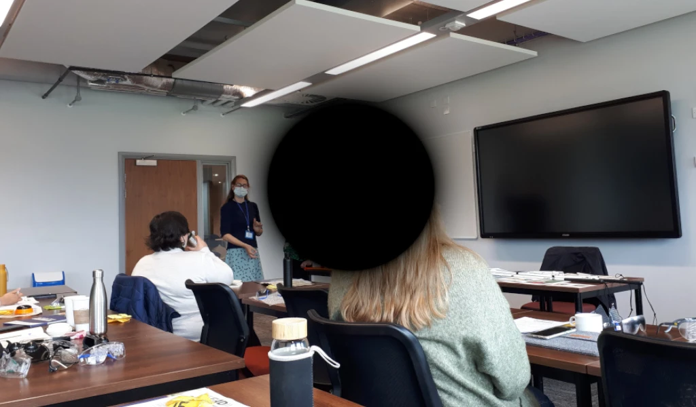
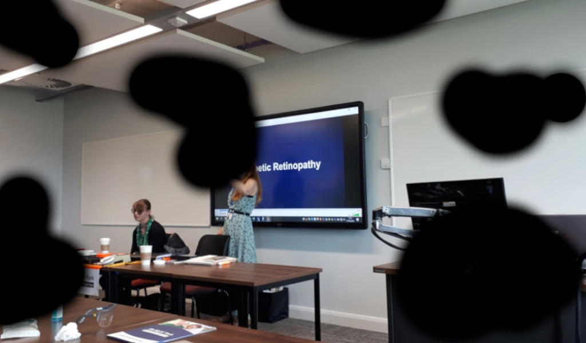
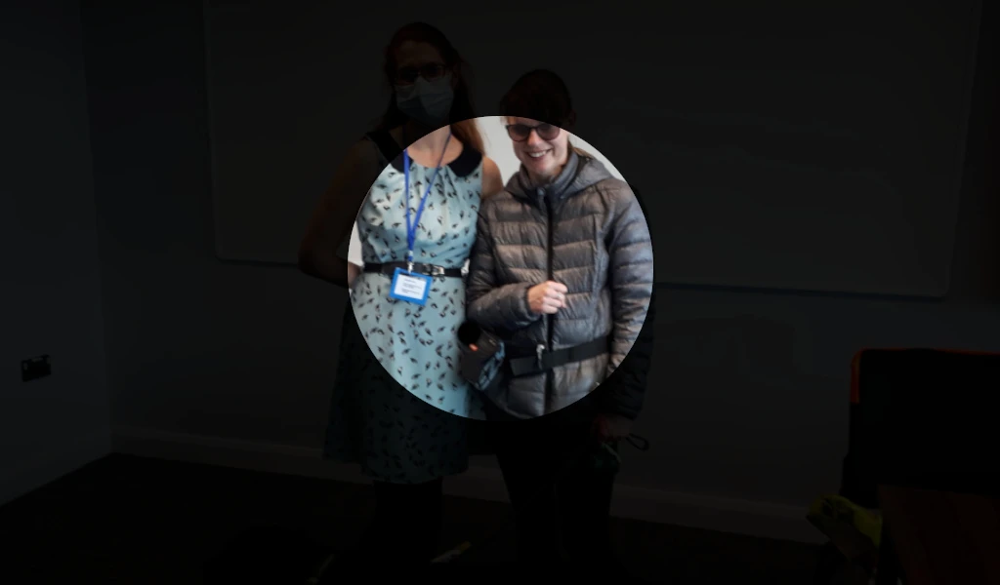
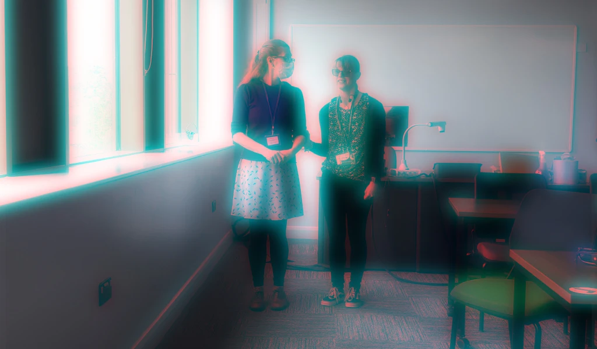

Last June, we did two workshops with [MySight York](https://www.mysightyork.org/), a local organisation in York supporting visually impaired people. The first one was a whole day training session delivered by Vicky and Jade from MySight York.

 

On Tuesday the 7th of June, the EAD team, along with eight other university members, attended MySight York’s [Visual Impairment Awareness Training](https://www.mysightyork.org/about/services-for-business/). We wanted to make sure that attendance to the training was open to interested staff and students as we are keen to increase awareness of visual impairment within the university. Our trainers were Community Involvement Officer Vicky Smith and Group Assistant Intern Jade Puckering.

Since I had been working with Mariana and Gavin on the previous EAD project a few years ago, I had some insights on visual impairment. With a thorough introduction to the various types of visual impairments, a description of a typical day in the life of a blind person (Jade), advice on how to behave around guide dogs, and practical instruction on guiding inside and outside of buildings, the workshop was not only reviving but also deepened my understanding of the topic.

Vicky and Jade brought a set of simulation glasses so that they could explain different conditions. For instance, macular degeneration makes it challenging to read and recognise faces. The illustration below demonstrates how this syndrome affects central vision.

Diabetic retinopathy also affects eyesight. Reading and driving become challenging since patches of vision loss emerge. See the example image below.

The workshop also explored glaucoma, which causes loss of peripheral vision, as shown in the image below.

Cataracts which result in blurred vision, were also discussed. See the image demonstration below.

<!-- We were warned that this experience could be upsetting. -->

While many blind or visually impaired people feel confident travelling alone, there may be occasions when a human guide is needed for instance in a busy or unfamiliar environment. Our practical session in the afternoon involved sighted guiding, for which we teamed up with a partner. We were either blindfolded or wore one of the simulation glasses while our partners were ushering us around the room, through doors as well as up and down staircases. Vicky and Jade gave us a few tips on how we could become good guides. For instance, we need to introduce ourselves to the visually impaired person and ask whether they would like assistance. It is important to understand that sometimes help is not needed. If help is needed, it was suggested that we offer our right upper arm for them to hold onto with their left hand. When guiding, it is crucial to continually monitor the environment and to provide information on the surroundings. When describing the environment, it is best to be as specific as possible for instance by mentioning how many feet away the steps are. From Jade’s stories we also understood that some human guides are too controlling while others too careful. Communication can help us find a good balance that works for the person being guided.

It was a great day. Vicky and Jade put together a very interesting workshop that not only helped me learn something new about accessibility but was also very fun and enjoyable! Thanks to Becky, delicious food, including cakes and sandwiches that were all wrapped sustainably, was also provided. We were keen to reduce the waste linked to the event and asked the caterers not to provide any disposable cups, and instead encouraged attendees to bring a reusable cup. The Enhancing Audio Description Project has a commitment towards sustainability, and we are keen to do everything we can to reduce the carbon footprint of our project. This is something we will be reflecting on more and more as we start organising a conference on accessibility as part of our project.

Krisztián
