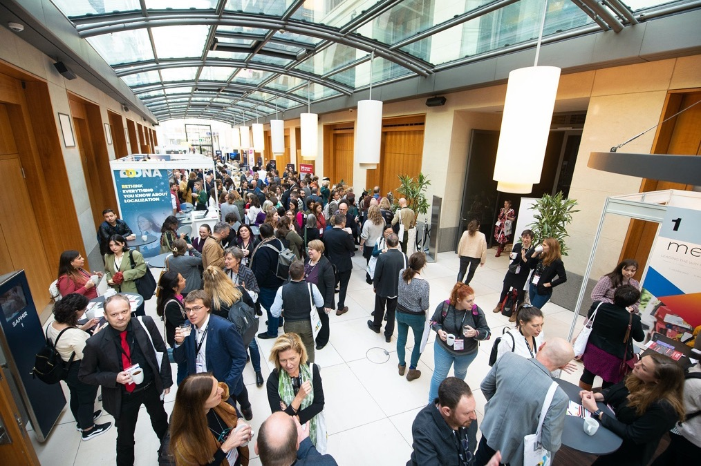
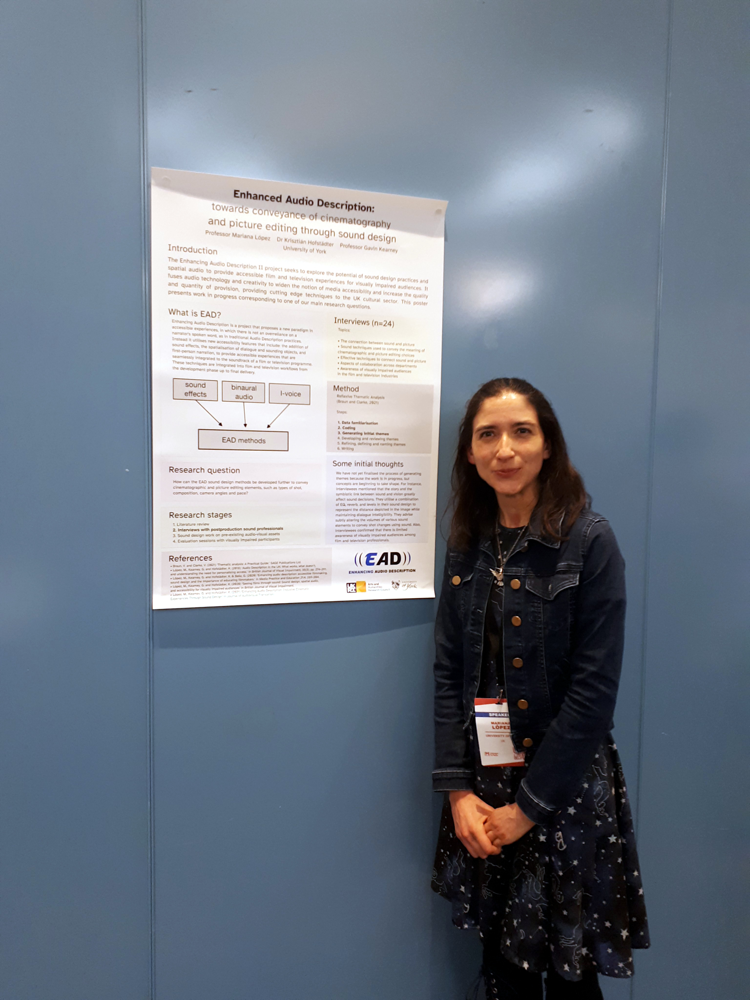

<!-- 1. general conference, aims -->[Languages & The Media](https://www.languages-media.com/conference_workshops_2022) is an international conference held every two years in Berlin. It has been going on for 25 years and is one of Europe’s most important audiovisual events. Its sessions and workshops look at the trends, innovations, and technologies that are changing the way audiovisual media is delivered around the world.

Mariana attended to lead a pre-conference workshop as well as present in the speed presentations/posters session.

 Photo credit: [ICWE GmbH](https://www.languages-media.com/) / [Dominik Tryba](https://introduce.berlin/)

<!-- 2. pre-conference workshop --> She led a half-day pre-conference workshop titled “Enhanced Audio Description: Inclusive Cinematic Experiences Through Sound Design” in which participants learnt about the ideas behind the EAD methods and how they relate to the fields of accessible filmmaking and integrated access. Participants were able to watch and talk about specific examples of EAD, and then in hands-on activities explore how they could use these methods to create outputs that are accessible.

<!-- 3. poster presentation --> Mariana also participated in the Speed Presentations session, in which she presented “Enhanced Audio Description: towards conveyance of cinematography and picture editing through sound design”. The presentation was followed by a poster exhibition to allow for further discussion with participants. Mariana reported ongoing work exploring how cinematographic and picture editing elements could be communicated through sound design as part of the EAD framework. The presentation focused on the interviews with post-production sound professionals on their own practice. The data is currently being analysed using Reflexive Thematic Analysis.

You can access the poster [here](../assets/docs/papers/LopezHofstadterKearney2022EADTowardsConveyancePoster.pdf).  

