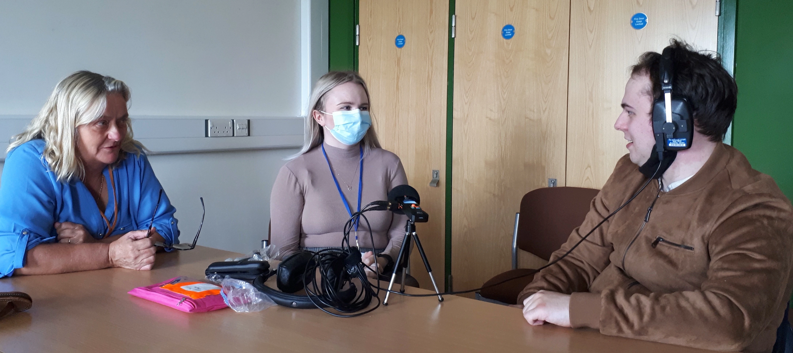

Following MySight York’s [Visual Impairment Awareness Training on June]({{ site.baseurl }}) 6th, it was our turn the following day to instruct some of its members on a topic related to our EAD project: *the use of sound for storytelling*.

Vicky from MySight York teamed me up with Jane Bateman, a skilled interviewer with in-depth understanding of crafting effective questions, so we could deliver a practical, hands-on workshop together.

The workshop took place in the Scenic Stage Theatre of the School of Arts and Creative Technologies in University of York's Campus East.

After all of us had settled inside the theatre, Vicky ran a brief icebreaker session to help everyone introduce themselves before outlining the agenda for the day.

Jane and I prepared two sessions each.

In the first session, I outlined variations in types of podcasts and called attention to the audio material and techniques used. I demonstrated and commented on spontaneous and rehearsed conversations, uninterrupted and edited narratives, the relationship between sound quality and the microphones used, post-production, how noise artefacts could aid storytelling, layering of soundtracks and jingles. The examples I used were from [Rebel Wisdom](https://youtu.be/vpLAcewRBSE), [Sound Exploder](https://songexploder.net/steve-reich), [Good in Theory](https://goodintheorypod.com/episodes/socraticfamilyvalues), [Trickster](https://tricksterpodcast.com/), [Murray Schafer](https://youtu.be/rOlxuXHWfHw) and the [BBC](https://www.bbc.co.uk/programmes/m0015vcw). The BBC example was from [an interview with Mariana]({{ site.baseurl }}), which gave a brief summary of our project and featured a scene from a [short film]({{ site.baseurl }}) enhanced with the EAD methods.

In the second and third session, Jane first introduced methods that can help us become good interviewers and then gave us time to practise what we’ve learnt in small groups. A key concept she emphasised was that interviewers need to learn to become good listeners (‘super receivers’) by using open-ended questions starting with the words ‘what’, ‘when’, ‘which’ and ‘how’. She also discussed the importance of researching our subjects before the interviews so that we can ask informed questions and the creation of a hook at the very beginning of the interview to make sure our audiences carry on listening.

The usage of portable microphones was covered in the session that followed lunch, with a particular emphasis on the [Zoom H1n](https://zoomcorp.com/en/gb/handheld-recorders/handheld-recorders/h1n-handy-recorder/) device. First, I played a brief sound walk recorded the day before in the building to help demonstrate the use of settings on this device, effective adjustment of signal-to-mic distance, noise handling, tripod use, reduction of plosives and wind noise using a windscreen, and gaining benefits of using a boom stick.

Then, after asking participants to divide into four groups, we gave each group a microphone and some accessories to experiment with. Groups were encouraged to either record a short interview, an interesting ambient sound with an introduction and an outro, a presentation from a prepared script or a sound walk.

We all returned to the theatre about an hour later to listen to each other’s recordings. 

The one I also engaged with can be listened to with the web-audio player below. The transcription of this recording can be found at the end of this post. 

<iframe title="Roving Reporters Training Example" width="100%" height="20" scrolling="no" frameborder="no" src="https://w.soundcloud.com/player/?url=https%3A//api.soundcloud.com/tracks/1427828215&color=%23ff5500&amp;color=daa95f&amp;inverse=false&amp;auto_false=true&amp;show_user=true"></iframe>

 
It was a lovely day getting to know Jane and other wonderful folks at MySight York. I hope we can meet again!

Krisztián

  

**Transcription of audio recording**

Jade: Already recording...

Krisztián: Okay. Guys, how was today? 

Lydia: Yeah, it was very good. Thank you!

Krisztián: What did you, ... what did you enjoy the most? 

Lydia: Hmm.. 

Jade: All of it, really! 

Lydia: All of it really, but we enjoyed listening to the podcasts. They were interesting, about how the different, like the sounds and different stories, and that there's a wide range of different people talking. So it was really interesting listening to that. 

Meg (York student): Was it [the workshop] what you expected? 

Jade: Hmmm... It wasn't really what, what I expected. I didn't really know what to expect, really. 

Lydia: I was the same. I didn't really know what to actually expect.

Meg (York student): But, you have had, ... have you had a good time? 

Lydia: Yeah, it's been really good.

Jade: Yeah.

Meg (York student): What do you think of the space, like the building? 

Jade: It was quite a good space. 

Lydia: It was yeah, it was a good space. And, it was a good venue to have it in really. Because, especially when it's ... when you're like recording things, being in a theatre, made it being in a .. it was really good, because it was like being in a professional, professional environment really. 

Meg (York student): And what's one thing you'd learnt today? 

Lydia: How to use a recording device. 

Jade: Yeah. 

Lydia: That's what I've learned to do.

Jade: That's the main one. 

Lydia: That's the main I have definitely learnt.

Jade: I am still sort of learning I think. 

Lydia: Yeah, we're still sort of learning how to get out heads around it. But it's definitely, it'll be a good, useful thing... for when trying to get visually impaired people to know our stories, and also to get them to listen to. So hopefully, they'll be able to either embrace the activity, or just find it nice to hear the, hear the stories really about all the different things we're going to talk about. 

Jade: Yeah.

Meg (York student): I was gonna say, how are you going to use these skills in the future? Have you got any plans, anything particularly you want to record?

Jade: Hmm.. 

Lydia: I don't really have any plans but, hmm... you know, it's always a good useful skill to have and it's always good to put on your CV saying that you have done this type of thing. So it can open the doors to, like job opportunities as well. 

Jade: I think it's interesting as well.

Lydia: And it's really interesting as well.

Jade: It's a new skill to sort of gain and... 

Lydia: It is, yeah.

Jade: Yeah.

Lydia: And it's good to have the experience on it now. 

Jade: Yeah. And to just sort of play about and then work things out...

Lydia: ... and then have it when you're working in an actual job.

Jade: Yeah. I think these are the main things really. 

Meg (York student): That was a good interview!
