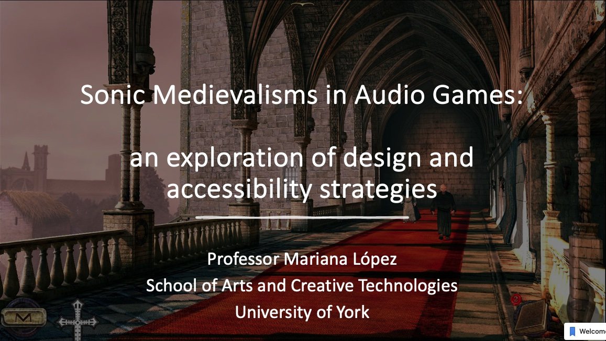
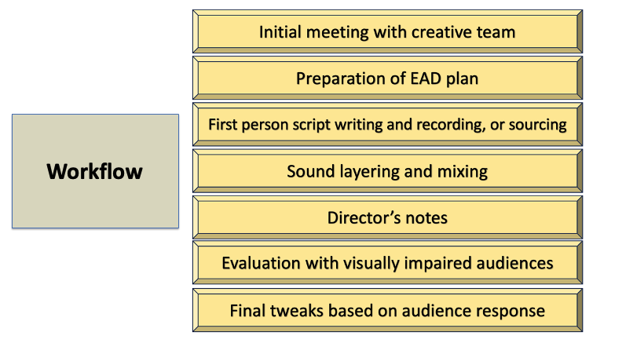

On the 4th July I attended the Leeds International Medieval Congress where I had the honour of being co-organiser, together with [Dr Robert Houghton](https://www.winchester.ac.uk/about-us/leadership-and-governance/staff-directory/staff-profiles/houghton.php), of the strand The Middle Ages in Modern Games, which included four paper sessions and a roundtable discussion. 

You might be asking yourself what this has to do with accessibility and with the EAD methods. Well, it’s more closely related than it appears at first. 

I presented a paper titled ‘Sonic Medievalisms in Audio Games: an exploration of design and accessibility strategies’ in which I explored the work I’ve been doing for a number of years in the field of audio games. Audio games focus on listening as a main game mechanic, identifying sounds and localising them is key to progressing and many of them use binaural audio. Although some audio games have minimal visuals (many don’t have any at all), the visuals won’t help the player win the game, and it’s the reliance on audio that does the trick. 

Audio games were a huge inspiration for my work back in 2008 when I worked on a format called audio films, in which I explored how a story could be told solely through sound without any visuals and without needing a narrator. It was that early work that evolved into EAD. The same as EAD, audio games tell the story of the game and allow engagement through sound and its spatialisation, with binaural often being used as a mechanic, and with first person mechanics being quite common as well. 

The presentation focused on discussing how medievalist audio games have used sound design simultaneously as an accessibility strategy and a means of conveying the Middle Ages. To do this, I discussed two games: A Blind Legend (2016) and Nicholas Eymerich: The Inquisitor. Book 1: The Plague (2014). As part of my discussion I explored the use of voices, the conveyance of environments, the use of auditory icons and earcons, and musical choices. 

Audio games were therefore explored as an example of how sound can provide accessible experiences through sound design, as well as the influence sound design strategies can have on the perception of medieval times.

I’m in the process of writing up an article on the topic of audio games and accessibility, but in the meantime if you are interested in reading more about A Blind Legend, you can find an analysis in a chapter I wrote for Robert Houghton’s edited collection, [Playing the Middle Ages: Pitfalls and Potential in Modern Games](https://www.bloomsbury.com/uk/playing-the-middle-ages-9781350242883/). 

The day after returning from Leeds I headed to St Pancras London and took the Eurostar to Brussels, and then took a train to Antwerp. The Enhancing Audio Description project has environmental sustainability practices at its centre, so of course I didn’t fly there! Why would I? I got to enjoy the views from the train window. 

I arrived in Antwerp on 5th July in the evening to attend [Media For All](https://www.uantwerpen.be/en/conferences/media-for-all-10/), one of the most prestigious international accessibility conferences. I presented a paper titled ‘Enhanced Audio Description (EAD): exploring first person description in accessible film productions.’ The presentation focused on two short film productions we worked on, in which EAD was integrated into the workflows. One was a short fiction film and the other a short animated documentary (more on this soon!).

The talk focused on our use of first-person narration, including how we collaborated with the creative teams to either write the first person or to source first-person related material from original documentary recordings. I was moved by the incredibly warm reception the presentation received, the feedback was overwhelmingly positive and the response to the sample clip we played was incredible. We are very lucky to have been able to collaborate with such talented teams.

I’m also incredibly proud to have been able to attend Media For All with two wonderful researchers from York, Kulnaree Sueroj who presented on ‘Audio Description strategies for conveying characters' actions and emotions: case studies on Thai television drama’ and Lacey Allen whose work focuses on ‘Accessible Narratives for ADHD Audiences.’

Mariana

Trainstation photo by <a href="https://unsplash.com/@katriinaegliitee?utm_content=creditCopyText&utm_medium=referral&utm_source=unsplash">Katrīna Eglīte</a> on <a href="https://unsplash.com/photos/a-train-is-parked-in-a-train-station-b4SPXVdNGw4?utm_content=creditCopyText&utm_medium=referral&utm_source=unsplash">Unsplash</a>.
  