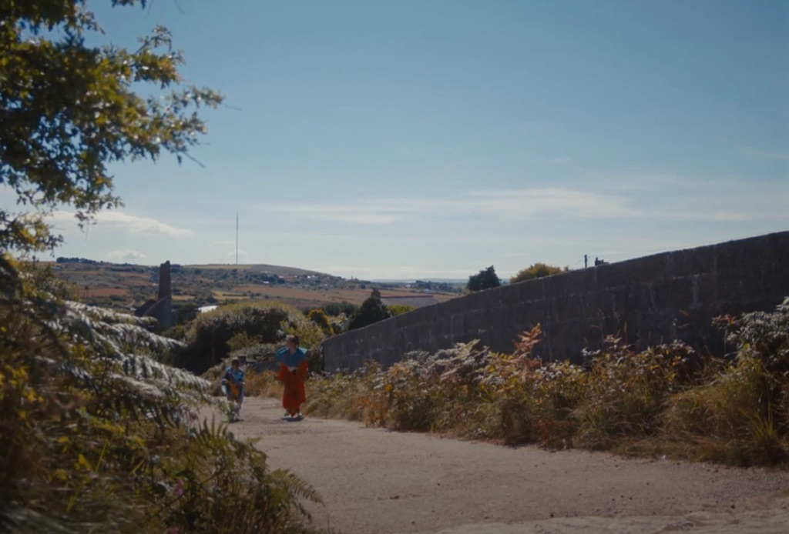

Last week at King’s Manor, [Mariana led a panel discussion](https://enhancingaudiodescription.com/kings-manor-discussion) that delved into the theme of accessible filmmaking, particularly focusing on the EAD methods, with Joe Inman and Samantha Moore.

Joe, a film director based in Cornwall and part of the film collective Bear Behind You, has a penchant for community participation and coastal storytelling. His recent work includes the film *Spines*, a significant project being the first BFI Network-funded film to be written, directed, and starring an autistic person.

Spines is a captivating short film that tells the story of Thomas, a shy, neurodivergent boy, and his newfound connection with Agnes. It’s a narrative that beautifully explores empathy and friendship. Both Joe, the writer-director, and the lead actor are neurodiverse, offering unique insights into their experiences in creating a BFI-backed short film. The production of this short film is actually a case study in working with neurodiversity, showcasing the potential for more inclusive filmmaking practices.

In this [study report](https://watershed.co.uk/filmhub/updates/news/spines-a-case-study-in-working-with-neurodiverse-talent-and-crew/), Joe reflects on the film's journey. He expresses hope that their study would be practically useful, contrasting with his previous experiences of finding industry advice too abstract or overly specific. Acknowledging the unique nature of each film set and crew, Inman aims to shed light on their distinct approach, driven by different priorities due to the involvement of autistic people, including himself and the lead actor, Oscar. He emphasises a chronological flow in documenting the production process, intending to capture diverse perspectives and learnings, especially around accommodating neurodiverse talent. This approach, Inman believes, would not only document their experiences but also potentially guide others in the industry working with or being part of the disabled community. He concludes by expressing pride in his team and gratitude for the support received, especially from BFI.

The Aesthetica Short Film Festival, a BAFTA-qualifying event held in York, UK, is known for being a major platform in the UK for moving image and digital culture. They recently featured *Spines*, contributing to the film's ongoing journey through the festival circuit and highlighting its significance in the realm of contemporary filmmaking.
