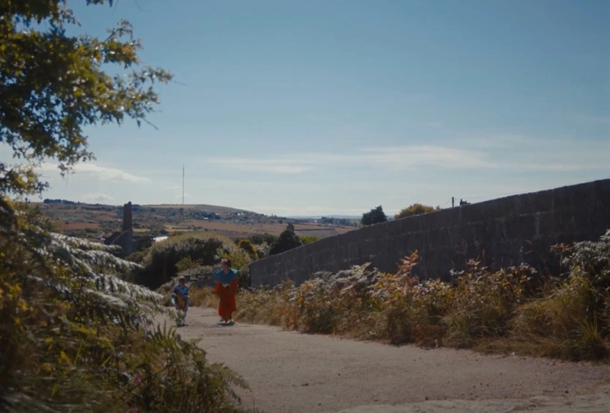

You can listen to the episode with the audio player embedded below. There is also a transcription underneath.

<iframe src="https://embed.acast.com/65942920c316a8001764d0b4/65ba19c379f0ba0015608744" frameBorder="0" width="100%" height="20px"></iframe>

 
Transcription of the podcast episode:

[UPBEAT MUSIC]

Mariana: Welcome to the second episode of the DARCI Podcast, the podcast on disability, accessibility and representation in the creative industries. My name is Mariana López and I'm a professor in sound production and post-production at the University of York. Today, I'm joined by Joseph Inman, a film director working in Cornwall. Part of the film collective Bear Behind You, he makes both fiction and documentaries with a focus on community participation and coastal storytelling. Their last film, Spines, was the first BFI network funded film to be written, directed and star on autistic person. Joe collaborated with the Enhancing Audio Description team in integrating EAD methods that is Enhanced Audio Description to Spines. By this, I mean the integration of an alternative to audio description in which sound design is used as a vehicle for accessibility by integrating sound effects, sound specialization and first person description. Joe, thank you so much for joining us today. How are you doing this morning?
I am well, how are you?

Mariana: I'm all right, yeah, it's a bit cold and rainy in York, but not too bad. We are delighted to have you here in our DARCI Podcast. And I was wondering if you could tell us a little bit about Spines for those who haven't watched the film. What is it about and what was your source of inspiration?

Joe: Spines is a semi autobiographical film about an eight year old autistic boy who gets by chance meets a new friend and their relationship begins to blossom over his love of this book he has and storytelling. And when she invites him around to hers to look at her dad's books, Trouble in Seuss, I guess, it's a sort of optimistic exploration of my experience as an autistic person growing up and how storytelling can be a vital tool for helping gain skills like empathy and compromise and all those sorts of things you need to be a good adult. And yeah, it's very, it supposed to be a very nice film.

Mariana: I like that you say it supposed to be. (laughing) It is indeed a very nice, it's a very nice film. And I've heard you've been going around to very many different festivals. Tell us a little bit about that.

Joe: Yeah, we were in, we premiered Encounters and we've been at Aesthetica, we've been in France. I think we're playing at a disability festival in Kosova today. I'm not there, unfortunately. But yeah, so just been trying to travel as much with the film as possible. And it's been a bit of a strange one. The previous films we've made, we made a documentary and we made an eight millimeter heist film. And they were very different experiences in the festival sort of circuit. We tend to now be in categories with this film for children specifically or about disabled issues. And that's a very different and much nicer way to travel around with the film. And so just trying to make sure that now the film is doing well, I get to see as much of that as possible. And especially when it comes to the ones that are looking specifically at films for children or films for and about disabled people. Yeah, just trying to make sure that I can really, well, I think be an ambassador for the film, but also you spend four years making these things in the dark and you do need to try and get the... It was very much a film made for autistic children and for the sort of child that I was. And any chance to be able to be in an audience of children watching the film gives me a great amount of joy. So I'm trying to do that as much as possible.

Mariana: Yeah, that's great. And I'm really glad to hear it's doing so well, very, very well, well-deserved success. And I was wondering if you can tell us a little bit about how did you work on accessibility in past productions? And what do you feel is the role of accessibility in your work?

Joe: Our past productions had only funded, mandated accessibility, so subtitles. And that was it. I haven't made a film about being autistic before. I, to my detriment had sort of very much a host view on accessibility, I think. And how that... It didn't affect the work in any way through production or in section. We weren't thinking about it. It was very much the case of, oh, most things after subtitles, I guess I'll make subtitles, the literacy by hand. [Mariana laughing] And, but apart from that sort of, yeah, I think it all seemed, especially when you're working on such time budgets and such, you know, low staffing throughout the production, that any engagement in accessibility was a big time factor, I think.

Mariana: OK.

Joe: And therefore we were, hmm... ... more, ...  [what] did the minimum requires, [both laughing] to satisfy whoever was funding the film.

Mariana: And what attracted you then to the idea of EAD as an integrated form of access through sound design?

Joe: I think it all changes when we go to make Spines and we go to make Spines  knowing it's a film that we want it to be seen by autistic people. And generally, ...,  there are caveats made for autistic people in cinema spaces, but the autistic-friendly screenings tend to have the lights up and the sound down. And we wanted to make the film [that] has a lot of sound effects in it that are replicating the experience of me as a child and how my audio sensory overload would work. And therefore there was a lot of deliberate audio sensory overload in the film. And I knew that I didn't want that to alienate the people who I was sort of making the film for.

Mariana: Yeah.

Joe: So I knew that there was going to be another version of the film anyway. And when we pitched, when we funded the film, we put an extra line in it to create an autistic-friendly sound mix for the film. And I thought it was relatively, going to be relatively easy. [both laughing] And it was a lot harder. Once I started doing research for what that would sort of entail, it was a lot harder than I thought. And therefore I was going to have to come up with sort of my own parameters of what is an autistic-friendly sound mix.

Mariana: Aha.

Joe: And that was obviously difficult because my experience as an autistic person is singular and there are loads of overlaps with other people, but I'm sure that there are lots of autistic people who have absolutely no overlaps with my experience whatsoever. So their autistic-friendly mix would be something incredibly different. So there was no sort of standardization of it, which I think mainly annoyed me and my producer, Lily. [Mariana laughing] And it got quite tricky quite quickly. And that also annoyed me. And then when we made the film and we worked, and I worked with the autistic leader of the film Oscar, it was, .... I think it took my accessibility politics from centre-left to militant wing. [Mariana laughing] And I genuinely thought that we wouldn't, without the accessibility money that we had through a public backer and the sort of luckily good grace of the brilliance of our producer, Oscar wouldn't have been able to make the film. He would be unable to access filmmaking as at all because of his needs. And that annoyed me. And I was just getting more and more annoyed [Marina laughing]  in one hand and finding it sort of life-changingly beautiful experience on one hand and then also incredibly annoying on the other. There wasn't really any tools out there to help us effectively. And so we made the autistic sound mix for the film and we knew that and then the BFI said, "Show us the video of what you guys were doing and send it through email." We thought it was a sort of sod it in for a penny, in for a pound. If it sucks for us, then it must suck for other people. So we were very sort of blind and naive, but all we thought of knew was, that we had sort of found out that the accessibility for autistic people in the filmmaking world is crap. And therefore we were having to try very hard to circumvent some of that rubbishness. Then surely the accessibility for everyone else is also crap. [Mariana laughing] And therefore we could make some move into being a bit more, I guess, radical in not just the space for autistic children that we're working with, but also a space for partially sighted and blind people or deaf people, just like anything. I think we just got very interested by post-production in how lacking it was across the board.

Mariana: Yeah, very interesting. And it kind of speaks to kind of sometimes where we find kind of a lack of access in one area and that kind of prompts us to become interested in access more generally. So it seems like this interest stemmed from your frustration and annoyance, which is, I always say one researches and works on things that you're angry about. So that's a good example, I guess.

Joe: Yeah, I would have not considered it beforehand. Just full stop, it was a blind spot on mine. There wasn't any, I think, I always, I was always quite interested in translation when I was reading books. I remember really going down a very big rabbit hole on who was the sort of best translation for Tolstoy when I was reading some Tolstoy. And there were many, many sort of big lengthy discussions by linguists of who out there was doing the best translations and all the ones that Penguin were using were like old Victorian translations and then Vintage were coming out with these new translations done by this couple. And I was always interested in that. And as someone who watches a lot of foreign films, I was also interested in the way that subtitles were pretending sort of to be objective in translation, but were obviously not objective in their translation. I remember going to see Endless Poetry, the Hodorowski film with my partner, who speaks Spanish. And we're watching the film and Hodorowski says to his son in the film, and the subtitle says, "The apple doesn't fall far from the tree". And Molly turned to me and whispered, I don't know what you said, but it was something about mountains and goats. (Mariana laughing) And so even in that respect, that's the sort of idiom that was translated in a subjective way. And so I think I had a lot of, once the task was posed of, could we be sort of openly creative with this sort of task that had before now in just AD is obviously subjective because somebody is writing it, but it's pretending to be the sort of objective voice to the audience.

Mariana: Yeah.

Joe: As soon as the sort of conundrum of, could we interestingly create something subjective to, and is it more interesting to be open about our subjectivity than sort of pretending to be objective? I was down. I, you know, that's always been an interest of mine. [Mariana laughing] I was very happy to mull that question over when it came to my field. You know.

Mariana: Yeah, thank you. And something that really impressed me when we worked together on Spines is how naturally you wrote the first person for Oscar. I was just like, when I read it, I thought, oh my God, this is just like perfect for the film. And I was wondering if you could tell us a little bit about how you worked to create that first person as part of the EAD framework.

Joe: Yeah, well, I found it a very fun and interesting task. I think obviously what we're striving for in all accessibility stuff is for it to not be ad hoc and for it to be late throughout production and thought about in pre-production and onwards. But I really wouldn't have been able to write it had I tried to write it previous to meeting Oscar. It was definitely, ... to be able to write, ... because you're working with a child and somebody who is therefore not really able to sort of create a cadence out and a manner of a character, they're using,  they might be speaking words that they've learned on the script, but they're very much using large parts of their own character. They can't change themselves, you know, like a sort of adult actor can in that way. So for it to come out naturally from Oscar's mouth, I needed to have spent time with him at that point and to have his sort of  his speech patterns lodged in my brain. And, you know, as a, I think as a writer, what I tend to do is, a lot of my job is memorizing people's speech patterns of people that, you know, I might meet for two seconds or know all my life and I am expanding on those ways of speaking and those. And therefore I needed Oscars to make it believable. And so I found that very, very helpful. And I wrote it as a poem. I think it was unpunctuated on lots of lines, whenever I, a sort of line breaking, killing a sort of breath for Oscar. And I did it relatively stream of consciousness. I did a sort of a scene that I would watch and I would talk over and then I would write down what I said. And obviously change it a little bit for things I didn't like, or maybe I was aiming for something. But those patterns, I would just get from watching the film and talking over it. And that was loads of fun. It was loads of fun as a sort of a puzzle to unpick, to go back to the film and think about what information I might not giving. Because I think the problem is as a filmmaker, you're taught to strip everything from your film that isn't visual. It's not television. It's supposed to be, you're sort of aiming for a sighted, captivated audience. And therefore you are always told that, "show don't tell", if you can show something that is much better than having a conversation. If you can show a relationship between two people in some way, whether that's a photograph in the production design or whatever, then that is better than say the line, well, you would say that 'cause you're my brother. And therefore it's slightly un-teaching yourself that and looking it in the different way of, okay, so if I think I've done quite a good job at stripping away all of the dialogue and really showing it visually, then I've got to put a lot back in. And then again, to sort of have a brain that says, okay, well, you want to do that, but you don't want to do it in bad writing. So you still got to do it in a way that suggests to the partially sighted person who doesn't experience the film and go, yeah, that was terribly written. And you're there going, yeah, but I got all the information across and a partially sighted person, yeah, but I wouldn't care, it was very badly written. And so you're sort of juggling those two things, which I loved. As an experience, I found it really fun, you know, different puzzle to the film.

Mariana: And it shows how creative the process is 'cause I know I've told you this, but of course people listening don't know this, but my favourite line of the first person is when Oscar says he's sitting at the kitchen table and his mum is bringing the sandwiches and we see him with the sandwiches and he says, "Oh, they smell of old people, they're from work". And I loved how that was just a response to my note that his mum is wearing a carers uniform. So I thought, well, we need to kind of show that, to tell that to people in the EAD version. And I was wondering, how did you come up with that line? 'Cause it's just so beautifully integrated.

Joe: Yeah, I think that is part, that is the big task is to look at the film and go, okay, so totally visually in the film, the sort of class politics of the film are sharp. Oscar lives in a smaller house, he's a single mum, she works in a care home, all of this is told visually. There is one line in the film where he and his mum are standing outside his new friend's house and she says, "You're moving up in the world." And that is the only thing that would tell a partially sighted audience what is quite a big point in the film. And so when you give a note, I sort of had a feedback and go, well, actually it is really important because whereas... That line would give a partially sighted audience an indication of the world he is about to go in when he goes in his friend's house, we have sort of no indication previous to that of his current circumstances. So that was sort of something that was obviously missing when you just looked at the script and we needed, I think obviously I sort of, I mowed, you know, I probably wrote 100 versions of the line and was thinking constantly how I would use the methodology of "show don't tell" to tell naturalistically, obviously. And the sandwiches, I think were the, ... It never occurred to me that she might bring the sandwiches back from work and they were eating them as a cost cutting measure. That was never a thought for the whole of production. They were just cucumber sandwiches. And in the original film, the sort of purely the thought process for me is that they were cucumber sandwiches and cucumber sandwiches are very like simple and plain and tasteless and autistic children and me as an autistic child had a particularly difficult time with tastes and foods. And I wanted to sort of give them a really bland food as a sort of nod to that. That was the original sort of intention of sandwiches. And, but you get these moments when you're writing where you'll think of something and I think the sandwiches thing was purely written as a way of saying that she's in a care hone. And then you think of it deeper and you go, okay, but you also saying that she's bringing food from work to home to feed her kids. And that says something economically deeper than that. And then you just pat yourself on the back and say, "Good job, well done." I tell myself "Take the afternoon off". [both laughing]

Mariana: Yeah, and yeah, the first person worked so well that we had a moment when we were mixing the EAD audio for the film where my colleague was sitting with me and it was the first time he heard the first person and he was like, "Oh, it's great that this isn't the original and it works so well." And I'm like, "No, no, this is us. We did this work." And it's really good. I love it because the idea of EAD is that the accessibility is so integrated that if you didn't know, you wouldn't be able to differentiate when, what is the, let's call it original film and what is the accessible version? And I think that was definitely incredibly well achieved through your writing.

Joe: Yeah, and obviously it helps, I think, that the film is so first person. I don't know how obviously the task is tackled in different ways for everything and the film lends itself to it because it is so first person.

Mariana: Yeah, absolutely.

Joe: And therefore you can write a very, you know, a sort of the voiceover is from inside Oscar's head and it doesn't, it's not clean in it. It's like, it's not a written thing. It's a said thing. He [inaudible], he talks over himself, he, you know, and we're trying to replicate somewhat of his internal monologue. And that fits with the film really well, which I think is obviously a great coincidence for us, but, you know, I wouldn't know how it would, but it's absolutely hammering it down with writing. (Mariana laughing) Yeah, I wouldn't know how, I think for every, I think the point is, isn't it, that for every project you would totally address it in a different way and by the early you start to think about that, the more interesting your results are going to be. If you're thinking about it, like I was about subtitles for the 11th hour, then it's never gonna be that good. And we really found that because the BFI wanted AD, we had to get, we were gonna have to get a lady into a booth anyway. [Mariana laughing] So, you know, it felt very much like if you were gonna make that leap, like that was time consuming anyway. And therefore we were, we might as well do it interestingly. And I think if the BFI weren't, I mean, the good thing is if the BFI didn't mandate that we make an AD, that we were even considering that, then we would be here for a stop. And therefore, I think that is something to be praised, even if, you know, we're looking at more interesting ways and giving people more creative options and experience in the films. Still as a filmmaker and the filmmaker making a film by a disabled person, I still needed to be contractually obliged to enter this space. And that's the sort of mindset that we need to change.

Mariana: Yeah, yeah. And I think, you know, we're very grateful to the BFI that kind of has promoted our work and given their filmmakers an option of actually trying something different in terms of accessibility. So a good opportunity to thank the BFI from our side as well. And of course, in addition to the voice recordings that we added for the first person, actually most of the EAD work focuses on the addition or rebalancing of sound effects to clarify meaning, as well as the spatialization of sounds and voices. And I was wondering, was there anything about the changes we made to your film to create the EAD version that surprised you in terms of how that could help provide access?

Joe: I think, I think as somebody who plays video games and video games with binaural sort of soundscapes in them, I think I was probably a bit more informed than somebody going into it about the sort of space that you're working with and what that helps. So I wasn't like shocked by anything or like, (Mariana laughing) over rolled by what the tools you had at your disposal. So I sort of knew what it was going to be like going in. And it is always fascinating to sort of listen to it and to, ... It just really, I tend to direct a lot with my eyes closed. I have a really good relationship with my cinematographer. And once we sort of planned out on the day, I have a lot of faith that he will achieve what we want to achieve. And it leaves me really, therefore in the moment to focus on performance. And I find it much easier to at least in a couple of the takes or in rehearsal to close my eyes and really understand the performance that way. And it was great to be able to do that with Spines through you guys working in binaural sound. It was like being back in the room and that was such a nice way to live it for me because you can sort of ... I don't know, I think we have a lot of bits in the film where we did the naturalistic ... Is digesting sound effects the term?

Mariana: Yeah.

Joe: Sound effects in the film and the music of his brain takes over in the film. And obviously it was interesting for me to see how you resolved those sorts of conundrums in the film. I was looking forward to that before I heard the version to sort of, once I knew what endeavor you were undertaking, I was interested in the sort of creative challenges that our film had set by essentially dropping out all the diegetic sound at points to have his brain lead the way.

Mariana: Yeah.

Joe: And we have a lot of scratching in the film and things like that, they're very heightened and it was very interesting to me how you were going to get that across again without overburdening the listener. So they're not taking the other information that is key that is coming across purely visually at the time. I was just interested, I really liked it. I was always excited.

Mariana: Thank you. And of course, just for the listeners that might not know this, we do test all our EAD versions with visually impaired people. So we assemble a group of paid participants and they complete, they watch the film, they complete a survey on their thoughts about it, but also we have a focus group discussion and based on that discussion, we provided a summary for you and also after that, we kind of agreed on what changes needed to be done. So everything has that really, really important input. And I was wondering, what are your plans to use, the EAD version of your film?

Joe: Well, I send a cover letter to every festival that we're in. The outlines of the film has two other sound mixes, autistic friendly sound mix and the EAD sound mix, and they are, if they want to use them, then to contact us. I think obviously in short film, when you're, you're not only, you're dealing with a sort of two years cycle of the film being relatively secret as if it's playing at film festivals, and then you sort of come back to you and you have a multitude of options of how to exhibit it in the world. And we really haven't come to that bridge yet. We're only like three months into our sort of two years of the film cycle. And so we, because it was the first BFI network funded film to be written and directed by an autistic person and also star an autistic person, they asked us to do a case study on that. And I think in the accessibility department, the case study is what leads the way with Spines and hoping to just get as many people to sort of be able to access that and that it exists. And those things is really important for us for now. And that has a section on the post accessibility stuff including EAD and also deals with accessibility throughout pre-production and production itself. And so there's definitely, I think the film comes as into the world as a championing of accessibility. And EAD is one of the prongs of attack in that. And so right now we will be playing the film will play at Oska Bright in Brighton, which is the UK's biggest disabled film festival. It's playing at Disabled Film Festival in Kosova today. So like, it's out there and if there's many, disabled people can see it and gel with it, then that's great. And I think with EAD, I think it's, we're on such a cusp with whether it's to say we wanted to put it up on YouTube or whatever post two years ago or Vimeo, once the film has finished its cycle. I'm still sort of relatively in the dark in how they work with the spatial stuff, whether you can upload into 5.1, 7.1 or and all of those sorts of things. So I'm still very much yet to cross that bridge on how when the film is done, we can best exhibit it to partially sighted people and just to people.

Mariana: Yeah.

Joe: And having these sorts of three distinct versions of the film gives it a sort of three separate conundrums.

Mariana: Yeah, I mean, the beauty about the EAD version is that because it's binaural, you just have the two channel version. So it just uploads like a stereo mix. So hopefully that means that people can just listen to it over headphones without having to have the kind of sophisticated loudspeaker systems, systems or others. Yeah, yeah.

Joe: And then that's great, but then you have that headphone caveat so obviously for film festivals, it's relatively impractical. And so yeah, we're just sort of starting out in the world and working out what is going to be the best way to get the film to audiences. And it's very interesting, like you said, with our focus groups, that those are focus groups of adults and a lot of the incredibly interesting and thoughtful comments we had about the film and the EAD mix, because they're sort of separate and together, like we had focus group comments that were sort of purely about the film and ones that were about their accessibility to the film. And obviously the ones that are about their accessibility were very helpful for you in your research. But the ones about the film were sort of equally interesting to us and as a film that is meant for children, but it's playing at a lot of adult film festivals, it is always interesting to sort of hear the reactions of adults and go, well, is ... You know, what are you coming to the film with as an adult that's different to what I wanted, what a child might be coming to the film with. So again, I think exploring what we spoke about of the opportunity of it being played to partially sighted children is obviously a totally different cover of its own challenges of getting the film to those partially sighted children.

Mariana: Yeah.

Joe: But that's another interesting thing that we're yet to, to succeed in which hopefully over the sort of net in the life of the film, we will be able to.

Mariana: Yeah, absolutely. And just to wrap up, what's next for you? What are your next plans for production?

Joe: Well, [inaudible] ... let's transfer to production. I've been writing, so I went back to writing, I work as a job with disabled children, mainly autistic children who are sort of on the edge of education and have quite severe behavioral or developmental needs. I am writing a sort of feature expansion of some of the themes that Spines deals with. And so just going through that process of writing at the moment, which is very much liking. And then we might make something in the new year that is about cricket, one of my first loves. (Mariana laughing) And yeah, and we're sort of constantly doing stuff. Like we're just about to release the second of some films we made during COVID. That were sort of were remotely made. So lots going on, but it's very nice to have the sort of film festival scene die for a couple of months and be able to relax over Christmas. 'Cause I don't feel like I've had a holiday in a long time. I was in France with the film and it did not feel like a holiday. (both laughing) It very much felt like work. And it's the first time I've ever been abroad for work. And I thought it would be when people say, oh, jealous to me, I thought I would take some solace in that, but actually I was maybe thought I'd really like to be in bed right now at home.

Mariana: And this might be a bit confusing to listeners 'cause this episode will be released, I believe in February.

Joe: Oh yeah, sorry!

Mariana: We're recording, just so that everybody knows we're recording in December, hence the talk about Christmas. Otherwise they're gonna think we're just planning the following Christmas.

Joe: Yeah, yeah, yeah! [both laughing] It's currently December and the weather is really getting, you know, terrible stay inside, light a fire weather. And I think my body is getting ready to eat lots of food and [inaudible] for a couple of weeks. (both laughing)

Mariana: Well, who knows? Maybe in February people are still eating leftovers. It might still be topical.

Joe: Yes!

Mariana: Well, thank you so much, Joe! This has been a huge pleasure to have this conversation with you. And thank you again for trusting us with the accessibility of your film. We're super proud of what has been produced and really, really glad it's doing so well in the festival circuit. So thank you so much!

Joe: Yeah, no, thank you. It's been an absolute pleasure to do and incredibly eye-opening, but also, I remember a point where we were at with Spines, when we were sort of working our way through the accessibility questions on the autistic side. And me and Lily would have these long conversations about it and they would feel quite lonely.

Mariana: Yeah.

Joe: And I'm just incredibly happy to have met you guys and done the EAD of the film and now be able to show the film at places and spaces for disabled people that I don't feel so alone in it now, which is lovely. So just, you know, incredibly grateful for the opportunity.

Mariana: Oh, thank you very much. And a lovely note to end this episode on. Thank you everyone for joining us today. Hope you enjoyed learning more about the process of EAD production for the short film Spines. And stay tuned for more DARCI episodes coming soon. Thank you for listening!

[UPBEAT MUSIC]

Photo by <a href="https://unsplash.com/@willfrancis?utm_content=creditCopyText&utm_medium=referral&utm_source=unsplash">Will Francis</a> on <a href="https://unsplash.com/photos/black-and-silver-headphones-on-black-and-silver-microphone-ZDNyhmgkZlQ?utm_content=creditCopyText&utm_medium=referral&utm_source=unsplash">Unsplash</a>.
  