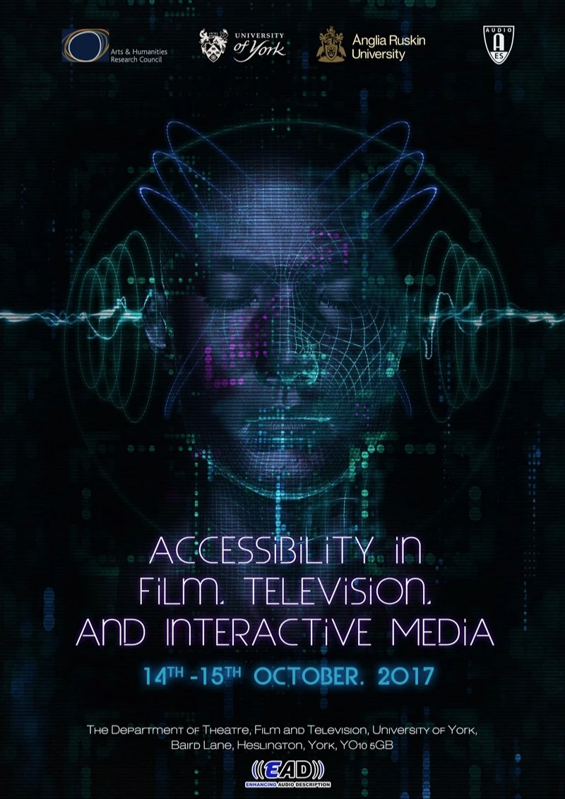

For a while, we had been looking into moving away from the logo we started using back in 2016, when we first started working on EAD as a format, stemming from my much earlier research on audio films. The main reason for the change was the desire to establish a clearer visual identity separate from AD. We wanted to highlight through the logo design that EAD is about accessibility through sound design, including short first-person descriptions, and audio spatialisation.  We love how the new logo indicates this through the level bars on the sides and how its three-dimensional format hints towards spatialisation, while also integrating the main letters as an image.

Oswin is the Creative Art Director & Concept Artist at Viridian FX and a long-time collaborator. Oswin and I met at the University of York back in 2010 when Oswin was carrying out an MSc in Postproduction with Visual Effects and I was undertaking my PhD and working as a Graduate Teaching Assistant. Since then, I have been incredibly lucky to get to work with Oswin on a number of projects, including event posters such as the one for the 2017 Conference on Accessibility in Film, Television and Interactive Media in York. 

 

 

Oswin also carried out the visual design for the project ‘[The Soundscapes of the York Mystery Plays](http://soundscapesyorkmysteryplays.com/soundscape/)’ funded by the British Academy and the University of York, working on how to provide engaging visual cues to accompany the recreation of the sounds of the York medieval cycle, taking as a basis environmental storytelling notions (Jenkins 2004) to provide listeners with information on what was being listened to without crowding the interface. As a result of this work, we authored a book chapter together with Dr Marques Hardin, titled ‘The Soundscapes of the York Mystery Plays: Playing with Medieval Sonic Histories’, in Robert Houghton’s volume [Teaching the Middle Ages through Modern Games: Using, Modding and Creating Games for Education and Impact](https://www.degruyter.com/document/doi/10.1515/9783110712032/html?lang=en), published by De Gruyter in 2022.

We hope that the logo does not only identify the project but the methods themselves, and we aim to use it at the end of the productions that we work on so audiences know there is an EAD version available. 

Thanks Oswin!

Mariana
