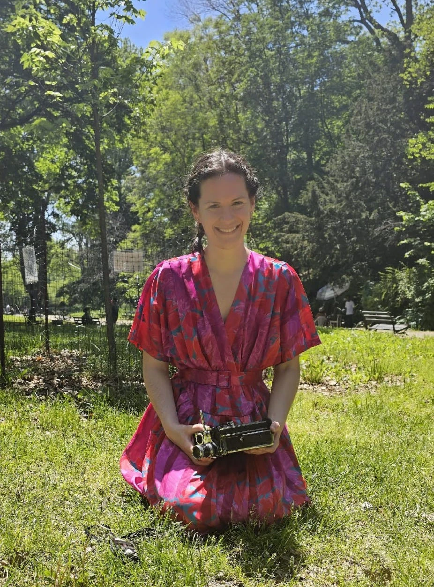

 

**Fluid Borders: Creative Collaboration and Collective Care in Moving Image Practice**

It is in collaboration that I have encountered the complexities and possibilities of disabled-led artistic practice and research. These collaborative moving image projects have produced filmic bodies that disrupt prevalent representations of what we should be and do in society. Drawing upon examples from my recent collaborations with disabled artists and community members in the UK and internationally, I will share experiences of how interactions and interferences in collective practice can enable new dialogues and contributions to emerge within artistic practice and accessibility. Seeking to embrace complexity and multiplicity in process and outcome, I will consider how fluid borders between collaborators and practices can create flows of knowledge that enable diverse disabled experiences and perspectives to come into conversation with one another. As borders between bodies, internal / external, self / other, individual / collective, blur, a shared vulnerability emerges that holds the potential to dismantle hierarchies of power within the creative process. Centring artist and audience accessibility, I will reflect upon how this shared vulnerability can foster collective care, addressing potential stoppages and silos within the collaborative process by rendering boundaries fluid.

Emily Beaney is an artist, filmmaker and AHRC PhD researcher at the University of Edinburgh. Her practice-based research centres on themes of care, control and health inequalities. Working collaboratively with family, friends and community groups to share and explore lived experiences of embodied difference, illness and disability, her projects seek to communicate with, through and between bodies to reveal narratives that are hidden / unheard. Emily has shared projects across the UK and internationally in festivals, conferences and with organisations including the Southbank Centre, Alchemy Film and Arts, the Royal Scottish Academy, Creative Scotland, British Council and Unlimited.

Find out more about our symposium [here](symposium-announcement).

