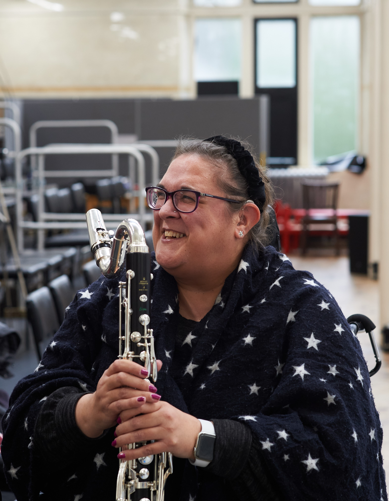

 

**Capturing sound and music in words - Using captioning as part of performance practice**

In 2020 when we all experienced lockdowns and isolation everything was suddenly happening online which provided a ready platform for those who could access it. This presentation describes the journey through first steps using live captioning online to its transformation as a creative tool in its own right and an intrinsic part of my current creative practice and collaboration.

Sonia Allori is a composer, performer, researcher and community music therapist. Her PhD looked at the combination of words and music under the lens of gender studies and Italian heritage. She is a multi-instrumentalist and singer having performed in ensembles, orchestras and theatrical productions for many years. Her creative practice has words and music at its core combined with an insatiable curiosity about the world, a highly developed sense of the ridiculous and a love of nature. Recent commissions are: *Random eddies in the space time continuum* (2023) for live piano, electronic wind instrument, clarinet and recorded electroacoustic track performed at Dora Stoutzker Hall (Royal Welsh College of Music & Drama) in Cardiff in November 2023 commissioned by Drake Music Scotland/PRS Beyond Borders; *Deconstructing tartan* (2023) for clarinet and accordion performed in Aberdeen in October 2023 as part of Sound Festival and commissioned by Drake Music Scotland/Sound Festival. Sonia is currently working on several new commissions in 2024 and will continue research at the Royal Conservatoire of Scotland in 2025.

Find out more about our symposium [here](symposium-announcement).

