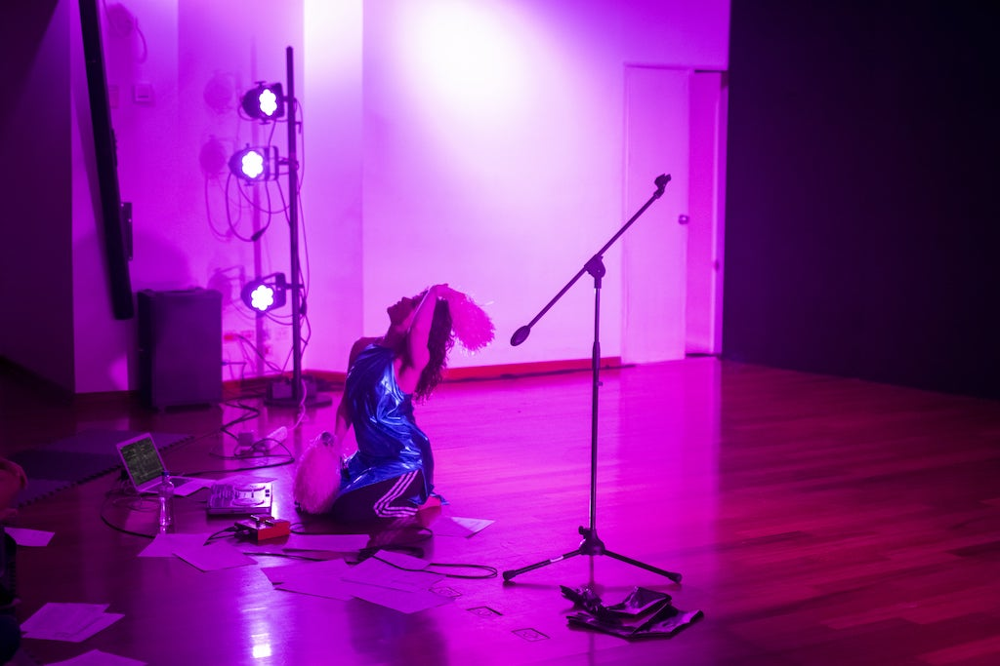

**A Dip into Disordering Dance: Riffing on Neurodivergent Choreography**

Neurodiversity is the infinite variation of all human brains and minds. Yet, we live in a neuronormative society that assumes, expects and centres ‘typical’ ways of thinking, processing, feeling, and being. Neurodivergent choreographer and academic Aby Watson is really, really bored of that. Through practices of neuroqueering, her work underscores and exposes pervasive neuronormativity within mainstream Western dance culture; striving to disorder it to choreograph alternative potentialities. For this talk, Watson dips into her doctoral research to riff on modes of creating, performing, and experiencing dance that centre neurodivergent embodiments and consciousnesses. Passionate about neurodivergent-centred knowledge exchange, her performative style seeks a stimulating and engaging (aka not boring or confusing) presentation.

Aby Watson [she/they] is a polymorphic neuroqueer artist, choreographer, performer, academic and activist based in Glasgow. Her work takes many forms across contexts of performance and knowledge exchange, with a hyperfocus on neurodiversity.

With special interests in stimming, sensuality, presence, and consciousness, Aby's performances toy with tensions between virtuosity and the pedestrian; beauty and the grotesque; the silly and the serious. Her work has toured to venues including The Southbank Centre, London; Sophiensaele, Berlin; Británico Cultural; Lima, and Tramway, Glasgow; and has been supported by The National Theatre of Scotland, Unlimited, British Council, and The Work Room.

Aby has recently completed her doctoral research, 'Disordering Dance: Neuroqueering a Choreographic Practice', at the Royal Conservatoire of Scotland. The founding director of the Scottish Neurodiverse Performance Network, she is passionate about the creative potential of neurodivergence, alongside the inclusion, wellbeing, and equal equity of neurodivergent people in the performance sector. Aby is proudly dyslexic, dyspraxic, and has ADHD (with autistic traits). 

Find out more about Aby on [her website](http://www.abywatson.co.uk) and Instagram page at @disorderingdance.

Find out more about our symposium [here](symposium-announcement).

