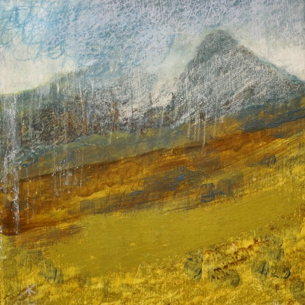

Keith has been painting the Scottish landscape ever since moving to Ayrshire in 1998. His paintings are based on his experiences while out walking in the mountains and along the west coast of Scotland. His work tries to convey something of what it is like to be out in these wild and sometimes remote places.  

Keith, who started to lose his sight in 1990, (several years after finishing art college) was then registered as blind in 1999. He has however, always been adamant that he should not be described as a visually impaired or blind artist …… just an artist who is visually impaired. He says, “My paintings have to stand alongside any other artists’ work and my visual impairment should have nothing to do with how the work is assessed”. As such, with the exception of the Oregon Project collaboration with Microsoft in  2016, he has tried to avoid creating work that is specifically about visual impairment or just for other visually impaired people. Instead he has simply tried to make work that, through its mix of paint and sound, allows anyone who does have a visual impairment to better interpret the paintings. Working with a professional sound engineer also means that the audio quality is very high and so for anyone who is totally blind, the soundscape alone becomes the landscape art.

Keith has worked as an artist all of his adult life but since 1990 he has just tried to adapt to his sight loss and this process eventually led him in 2015 to start thinking about combining sound with his paintings. He says, “I was lucky enough at this time to meet Graham Byron, a sound engineer with many years of experience in the industry and he was keen to get involved”. Since then, Keith and Graham have gradually been developing the work and to date, have completed around 20 audio visual pieces, which they call “Painting with Sound”.  

Most of the natural sounds are recorded while Keith is out walking with his wife Nita. On his return to Ayrshire, he takes the raw recordings to Graham’s studio where together they create the individual soundscapes. This is quite a time consuming process but even at an early stage Keith can play the sounds as he works on the painting, using them to help recall the place. Some of the soundscapes also have tonal elements added to them. These subtle and very beautiful additions are composed by Graham and they use them alongside the natural recordings to help convey mood.

