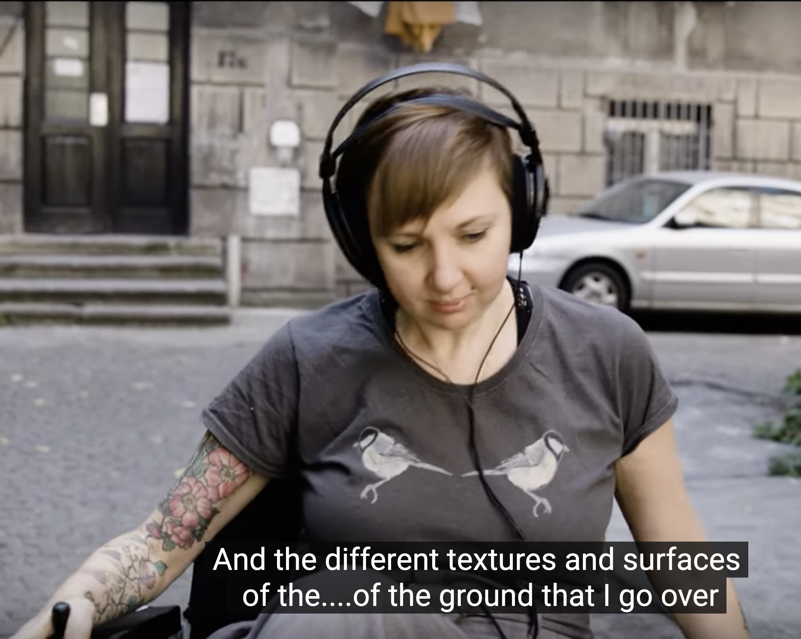

**Embodied Sound - Sounds Different to Me**

Each body will experience sound differently, we all have slightly different frequency curves to our hearing so different ranges will appear louder and quieter. More complex embodiments of sound are far reaching and are as diverse as the range of humans on the planet. In this talk Amble Skuse will explore a few ways in which disabled people may experience and use sound differently in their daily lives, how you might incorporate that into creative sound works and why this leads us to want to widen the sector to explore multiple people's approach to sound in everyday and creative life.

Amble is a composer and sound artist who uses disability theory, body sensor technology, spoken word interviews and electronics to create unique sound works. She is interested in the interface between the disabled body and the exterior world, and has explored this through numerous sound walks using her wheelchair.
 
Amble recently won a Special Commendation Daphne Oram Award for her work in electronic music, and was selected as Scotland’s representative for the International Society Contemporary Music Festival 2024.
 
Amble recently wrote Divergent Sounds in collaboration with Kings College London. The piece uses interviews with NeuroDivergent people, electronics, body sensors and a 13 piece orchestral ensemble. It was premiered at the Queen Elizabeth Hall at the Southbank.  She was one of five Creative Scotland International Creative Entrepreneurship Fellows, a BBC Performing Arts Fellow, has gained several large scale grants from Creative Scotland to produce work and was a BBC alumni fellow. She was also a Mimu Glove research resident in 2022.
 
Amble wrote a bespoke piece for instruments and technology for the British ParaOrchestra. Charles Hazlewood described her as a “fierce creative spirit! We couldn't ignore Amble's brilliance (a true sonic adventurer)”. Her album What News with Alasdair Roberts and David McGuinness was described in The Guardian as “Skuse’s laptop textures offer slow-burning, elemental accompaniment throughout. So many intricate ideas here, so beautifully done.”
 
Her work We Ask These Questions of Everybody is a digital opera exploring the lives of Disabled people in the UK. It was premiered at Scotland's Sound Festival and gained a 5 star review from the "Politically important and an artistic triumph”.

Find out more about our symposium [here](symposium-announcement).

