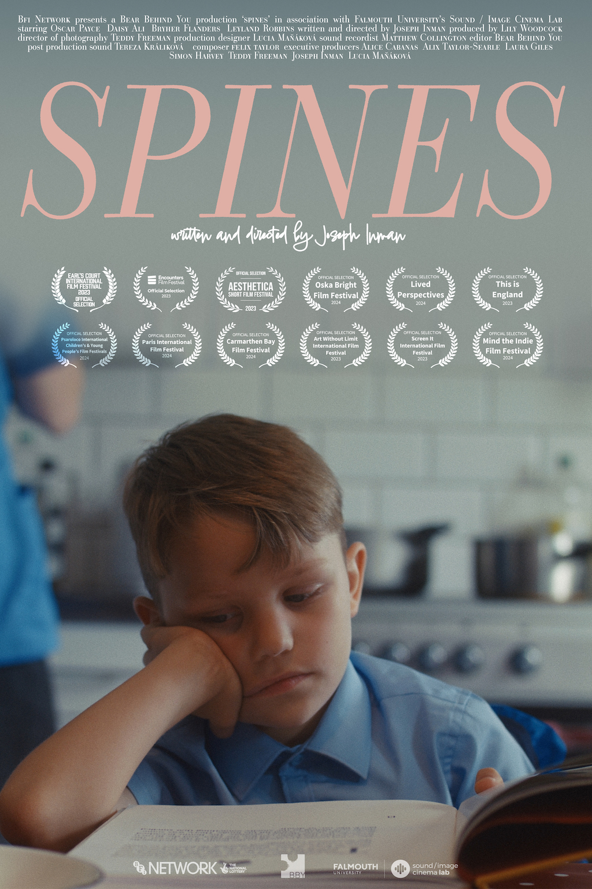

Date: Saturday 8th June  
Time: 1:30–3pm  
Speakers: Mariana López and Joseph Inman  
Venue: Dolby Europe Ltd, 4-6 Soho Square, London W1D 3PZ, UK  

The event will focus on how the Enhanced Audio Description (EAD) methods were applied to the film through a collaboration between accessibility and creative teams. The EAD methods are an alternative to Audio Description, in which sound design, audio spatialisation and first person narration are used to provide an accessible experience for visually impaired audiences.

We've written more about the journey of Spines, the first BFI Network-funded film to be written, directed, and starring an autistic person [here](neurodiverse-talent-and-crew) as well as have intereviewed the director Joe in the second episode of our DARCI podcast which you can find [here](darci-02).

Information on how to book a ticket will become available soon!

  