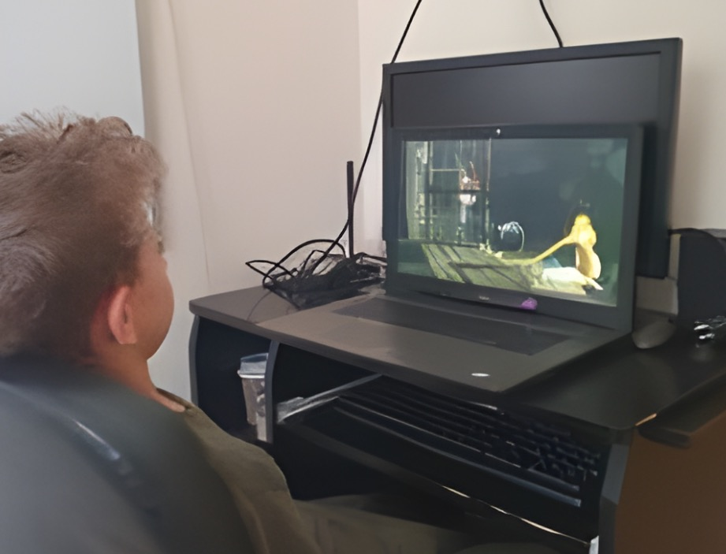

 
In my research funded by the Jagiellonian University’s Mini Grant within the POB Heritage Programme, my team and I explored the use of Audio Description (AD) to enhance cognitive audiovisual availability in autistic children. Our team, researchers from diverse fields including translation studies, linguistics, psychology, media, and culture, intended to investigate the potential benefits of AD for young autistic viewers.

The study was aimed to determine if presence of AD could improve visual information processing in young autistic viewers. Two types of AD were compared: neutral and emotional. Neutral AD used concise, emotionally neutral language, while emotional AD employed emotionally charged words and/or utterances, various stylistic figures, such as exclamations, rhetorical questions, metaphors (especially comparison-based ones and similes), direct naming of the characters’ emotions and explaining the reasons for them, as well as emphasising communication situations and social interactions showed in the films. The study sought to assess whether these different styles of AD influenced how information was processed by the participants.

We conducted a study involving seventy-six native Polish-speaking children from Kraków and Lublin, utilising an eye tracker to measure their engagement with audio-described content and administering questionnaires to assess their comprehension. Our participants included both autistic and neurotypical children, with the latter forming a control group for comparison.

Our findings revealed that emotionally tuned AD significantly improved comprehension of the film’s plot, characters’ emotions, and understanding of cause-and-effect relationships, compared to no AD or neutral AD. Interestingly, AD didn’t significantly alter visual attention; rather, it complemented visual content, particularly when emotionally engaging. This underscored the role of emotion in attentional processes, with emotional expressions consistently capturing attention.

We found that both autistic and neurotypical children benefited from emotionally tuned AD, with a more pronounced effect observed in autistic children. This highlights the inclusive potential of AD in improving cognitive audiovisual accessibility for all children. Therefore, supplementing audiovisual materials, especially those targeting children, with emotionally engaging AD tracks can enhance comprehension and engagement, fostering a more inclusive viewing experience for neurodiverse children.

 
Our research demonstrates that AD, particularly when emphasising emotional cues, has the potential to enhance audiovisual content processing in autistic children. By accentuating characters’ emotions, AD facilitates a deeper understanding of the content, making educational materials more accessible and inclusive for neurodivergent audiences.

The study of the creative use of AD and creativity in audio describing in general is also central to a study funded by the Polish National Agency for Academic Exchange (as part of the Bekker Programme) being implemented at the University of York’s School of Arts and Creative Technologies. This time, our focus lies on visually impaired young audiences, specifically school-age children and teenagers, and their reception of various formats of AD.

Since emotional AD has proven to be effective for sighted children, both neurotypical and neurodivergent, we have decided to investigate whether it will be equally effective as a supportive tool for blind people. To gain insight into this, in our study, we will present to young participants a short and amusing (yet educational!) film with emotionally tuned AD and neutral AD (although written in child-friendly language). But that is not the end! As the third option, we will present to participants EAD (Enhanced Audio Description), in which additional sound effects, narration and the spatialisation of voices and other sounds were used to make the piece accessible.

Testing sessions with participants have started, and we are eagerly awaiting the results. Beyond comparing the reception of these three types of AD, we aim to promote a creative approach to AD and accessible filmmaking as the primary means to make audiovisual products of culture fully accessible for diverse audiences, with particular emphasis on visually impaired and neurodivergent audiences.

Monika

## Connect
- E-mail: <a href="mailto:monika.zabrocka@york.ac.uk">monika.zabrocka@york.ac.uk</a> or <a href="mailto:monika.zabrocka@uj.edu.pl">monika.zabrocka@uj.edu.pl</a>
- [LinkedIn](https://www.linkedin.com/in/monika-zabrocka-348752b3/)
- [ORCID](https://orcid.org/my-orcid)
- [Jagiellonian University](https://przeklad.filg.uj.edu.pl/en_GB/monika-zabrocka-sliwka) 

