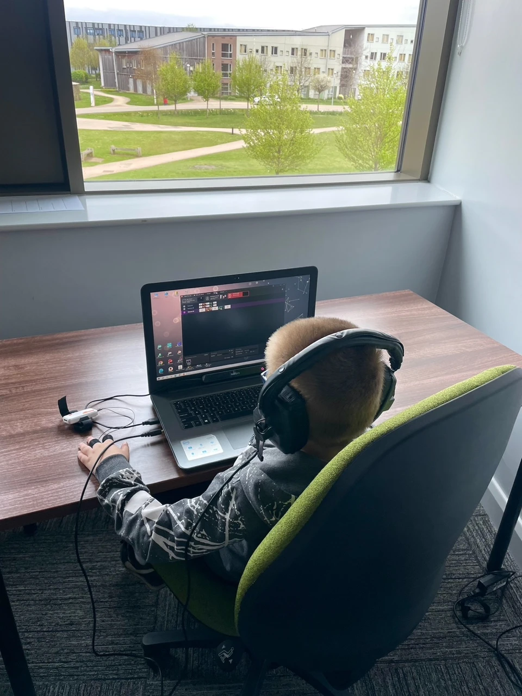
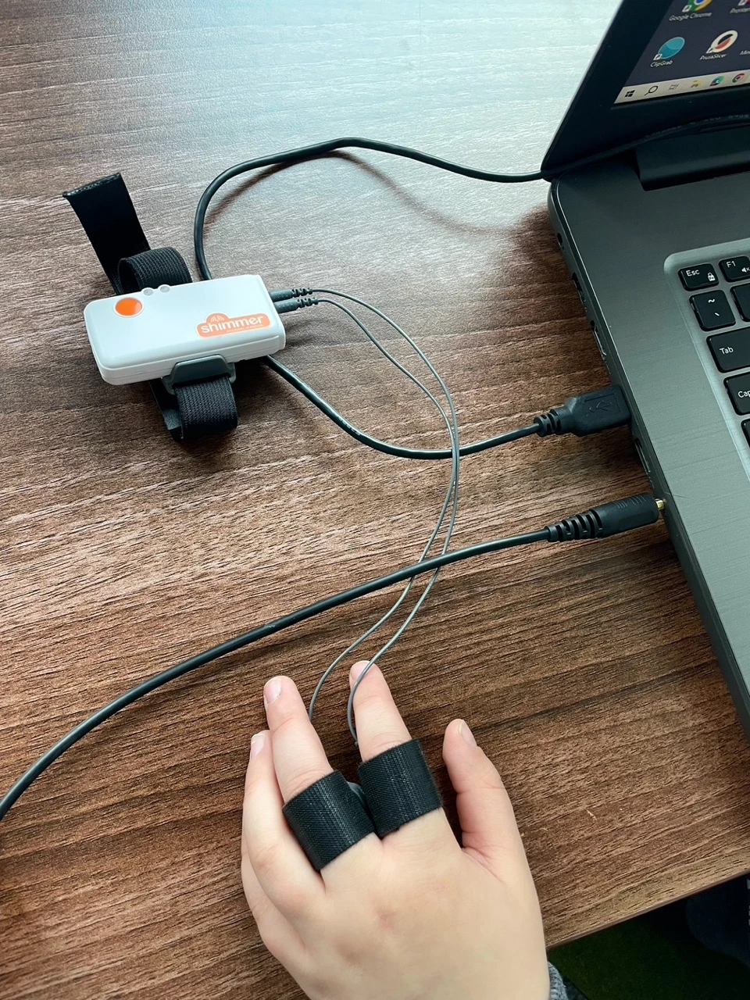

**Can audio description (AD) do more than simply describe the visual elements? The growing appreciation for creative AD formats suggests that they might replace the filmic images with truly impactful auditory content for visually impaired viewers. Crucially, these formats can be equally, if not more, informative than the standard, objective ones.**

As noted in my [previous post](monika-zabrocka-research), a comprehensive study was planned to be undertaken across the United Kingdom during the spring and summer of 2024 to empirically evaluate the efficacy of diverse AD formats and their reception among young viewers with visual impairments. This research initiative was conducted at the University of York’s School of Arts and Creative Technologies and funded by the Polish National Agency for Academic Exchange through the Bekker program as part of the 2022-2024 project entitled *Functionality and perspectives of unconventional AD formats: Accessibility of culture for children and teenagers with visual impairment.*

The implementation of this project at the University of York brought together an interdisciplinary and international research team of experts from different fields. This team included a linguist, Dr Monika Zabrocka (lead researcher on the project, otherwise associated with the Jagiellonian University in Krakow), a sound design specialist, Professor Mariana López (based at the University of York), and two psychologists – Dr Nick Barraclough (also based at the University of York) and Dr Grzegorz Kata (affiliated with the WSEI University in Lublin).

The study involved 36 children and adolescents (aged 5-18) with varying kinds and degrees of visual impairment. Participants were divided into three groups. Each of them was exposed to a 10-minute animated film featuring a unique stimulus, one of the following: a neutral AD, an emotionally tuned AD, or an Enhanced AD (EAD).

The sample size of participants was sufficiently robust for reliable results, given the prevalence of visual impairment among UK children. The study encompassed both neurotypical and neuro-diverse children, exhibiting a diverse spectrum of visual impairments including refractive errors, nystagmus, optic atrophy, and significant vision loss to total blindness. Neurodiverse participants, such as those with mild intellectual disorders, ADHD, and autism spectrum, were required to demonstrate high functioning levels. Moreover, all participants needed to perform a verbal ability as well as the absence of a severe hearing impairment to ensure their capacity to perceive auditory information and respond to the questions included in the post-screening questionnaire.

Despite the random nature of group assignment due to ongoing recruitment, participants were stratified into the three aforementioned groups to the greatest extent possible based on age, type of visual impairment, and developmental factors. Gender balance was maintained across groups, guaranteeing equitable representation of boys and girls.

Participants were presented with stimuli on a laptop screen and received various AD tracks delivered through built-in speakers (neutral and emotionally tuned AD) or headphones (EAD). To assess physiological responses, participants wore a non-invasive Shimmer3 GSR+ device that measured skin conductance. Their faces were ‘recorded’ with a digital camera, and the face expressions extracted using Noldus FaceReader 7. For participants with minor visual impairments, a Tobii eye tracker monitored visual attention and pupil dilation. These tools provided valuable insights into participants' emotional arousal and engagement. To evaluate their subjective experiences and opinions, a post-viewing questionnaire was administered. It included questions regarding comprehension, preferences, and overall impressions of the different AD formats.

Overall, five hypotheses guided the study. First, both creative AD formats (emotionally tuned and EAD) were expected to be more appealing and engaging to viewers of all ages than the neutral AD. Second, plot comprehension was anticipated to vary based on AD type, with EAD potentially posing the greatest challenge, particularly for viewers with significant vision loss. Third, older viewers with greater film literacy and typically better vision were predicted to ex-hibit a preference for EAD. Fourth, emotionally tuned AD should facilitate better comprehension among the youngest viewers and those with intellectual disorders. Fifth, both neutral and emotionally tuned AD formats may be perceived as excessively fast-paced and/or text-heavy. The results of the study will be detailed in a separate paper published in an academic journal, planned for 2025. 

Monika

## Connect
- E-mail: <a href="mailto:monika.zabrocka@york.ac.uk">monika.zabrocka@york.ac.uk</a> or <a href="mailto:monika.zabrocka@uj.edu.pl">monika.zabrocka@uj.edu.pl</a>
- [LinkedIn](https://www.linkedin.com/in/monika-zabrocka-348752b3/)
- [ORCID](https://orcid.org/my-orcid)
- [Jagiellonian University](https://przeklad.filg.uj.edu.pl/en_GB/monika-zabrocka-sliwka) 