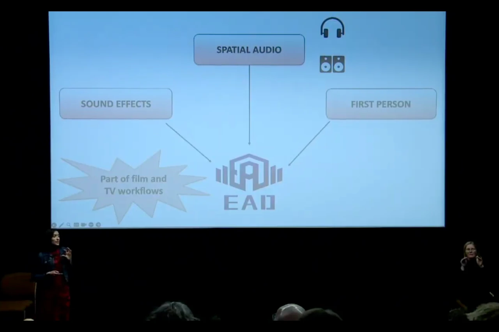
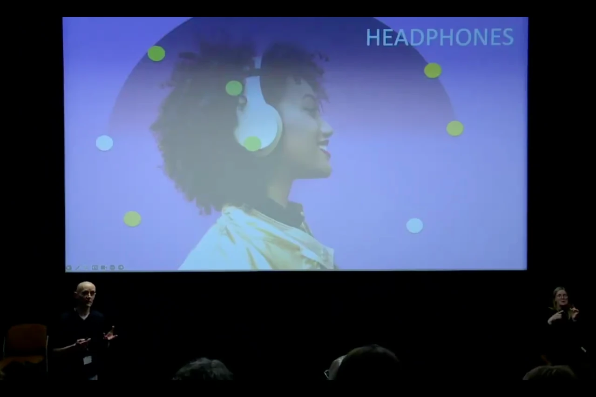

After introducing how our project develops a new approach to accessible experiences, Mariana and Gavin presented film scenes from their latest works with Enhanced Audio Description (EAD) alongside traditional AD, allowing the audience to compare these two methods. The talk also highlighted the importance of close collaboration between creative teams and accessibility experts.

The event featured a range of accessibility options, including BSL interpreter, hearing loop, step-free access, wheelchair-accessible restrooms, and accessible parking. 53 people attended the presentation, with overwhelmingly positive feedback.

