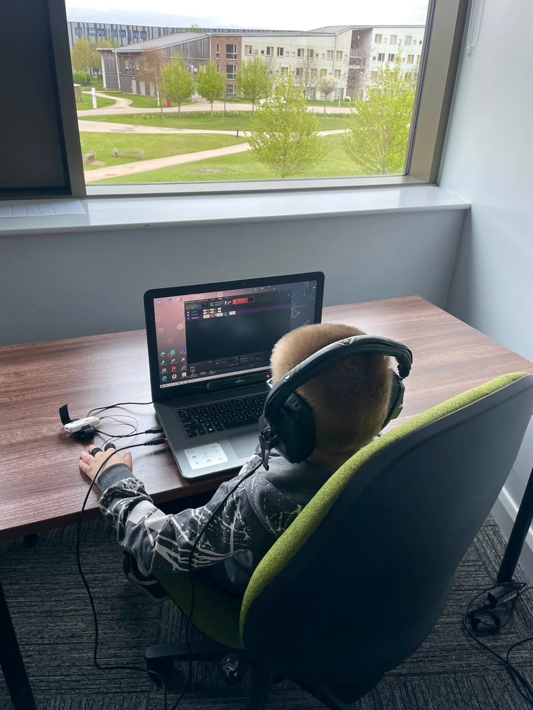
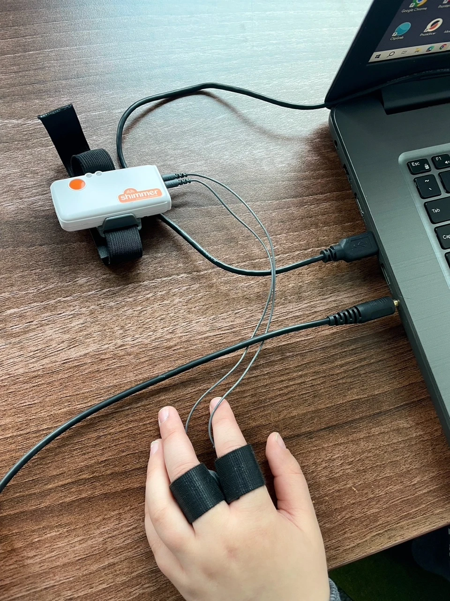

**Can Audio Description (AD) do more than simply describe the visual elements? The growing appreciation for creative AD formats suggests that they might replace the filmic images with truly impactful auditory content for visually impaired audiences. Crucially, these formats can be equally, if not more, informative than standard AD.**

As noted in my [previous post](monika-zabrocka-research), a comprehensive study was planned to be undertaken across the United Kingdom during the spring and summer of 2024 to empirically evaluate the efficacy of AD formats and their reception among young visually impaired audiences. This research initiative was conducted at the University of York’s School of Arts and Creative Technologies and funded by the Polish National Agency for Academic Exchange through the Bekker program as part of the 2022-2024 project titled Functionality and perspectives of unconventional AD for-mats: Accessibility of culture for children and teenagers with visual impairment.

The implementation of this project at the University of York brought together an interdisciplinary and international research team of experts from different fields. This team included a linguist, myself, Dr Monika Zabrocka (lead researcher on the project, otherwise associated with the Jagiellonian University in Krakow), a sound design specialist, Professor Mariana López (based at the University of York), and two psychologists – Dr Nick Barraclough (also based at the University of York) and Dr Grzegorz Kata (affiliated with the WSEI University in Lublin).

The study involved 36 children and adolescents (aged 5-18) with varying kinds and degrees of visual impairment. Participants were divided into three groups. Each of them experienced a 10-minute animated film from the series Mami Fatale [by Grupa Smacznego] featuring one of three possible types of accessibility track: neutral AD, emotionally tuned AD, or Enhanced AD (EAD). 

The study encompassed neurotypical and neurodivergent children with different types of sight loss. Despite the random nature of group assignment due to ongoing recruitment, participants were stratified into the three aforementioned groups to the greatest extent possible based on age, type of visual impairment, and developmental factors. Gender balance was maintained across groups, guaranteeing equitable representation of boys and girls.
Participants were presented with the animated episode on a laptop screen and listened to the audio either through built-in speakers (neutral and emotionally tuned AD) or headphones (EAD). This difference arose from the fact that EAD is typically delivered via headphones, whereas its delivery through speakers is currently under investigation. In contrast, it is more common for both neutral and emotional AD to be experienced through speakers. However, the deciding factor was that some neurodivergent participants declined to use headphones due to the discomfort they caused.

To assess physiological responses, participants wore a non-invasive Shimmer3 GSR+ device to measure skin conductance. Facial expressions were recorded using a digital camera, with the data processed by Noldus FaceReader 7. For participants with minor visual impairments, a Tobii eye tracker was used to monitor visual attention and pupil dilation. These tools provided valuable insights into participants' emotional arousal and engagement. To evaluate their subjective experiences and opinions, a post-viewing questionnaire was administered, which included questions on comprehension, preferences, and overall impressions of the different AD formats. Given the varied methods of delivering auditory stimuli, we will compare the reception of neutral and emotional AD, and – separately – analyse different aspects of EAD reception.

Overall, five hypotheses guided the study. First, both creative AD formats (emotionally tuned and EAD) were expected to be more appealing and engaging to viewers of all ages than the neutral AD. Second, plot comprehension was anticipated to vary based on AD type, with EAD potentially posing the greatest challenge, particularly for viewers with significant sight loss. Third, older viewers with greater film literacy and typically better vision were predicted to exhibit a preference for EAD. Fourth, emotionally tuned AD should facilitate better comprehension among the youngest viewers and those who are neurodivergent. Fifth, both neutral and emotionally tuned AD formats may be perceived as excessively fast-paced and/or text-heavy. The results of the study will be detailed in a separate, forthcoming paper published in an academic journal.

Monika Zabrocka

## Connect
- E-mail: <a href="mailto:monika.zabrocka@york.ac.uk">monika.zabrocka@york.ac.uk</a> or <a href="mailto:monika.zabrocka@uj.edu.pl">monika.zabrocka@uj.edu.pl</a>
- [LinkedIn](https://www.linkedin.com/in/monika-zabrocka-348752b3/)
- [ORCID](https://orcid.org/my-orcid)
- [Jagiellonian University](https://przeklad.filg.uj.edu.pl/en_GB/monika-zabrocka-sliwka) 