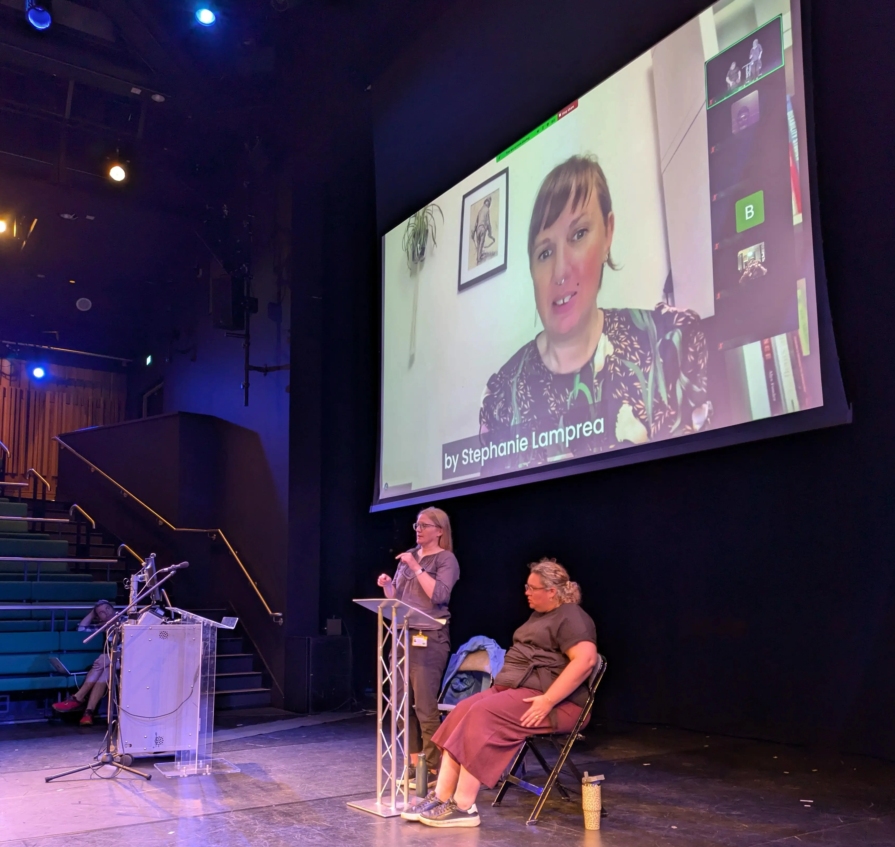

Back in April 2020, without any shortage of anxieties (for obvious reasons), I sat down and started writing the grant application for Enhancing Audio Description II in collaboration with Gavin. Somewhere within the 51-page document we wrote:

"We also plan to organise a 2-day conference on accessibility in the cultural sector. Participants will be able to opt between a live or virtual experience, allowing for participation of those with mobility restrictions, increasing the impact of the event and reducing the carbon footprint. The PI and Co-I will chair an organising committee, and will open up opportunities to doctoral students."

This turned into the DARCI Conference on Disability, Accessibility and Representation in the Creative Industries, taking the same name as our podcast and as a module I helped design, and teach. As sound designers, we tend to be short on name ideas and ‘Mr Darcy’ is popular in the UK, so it seemed like a catchy choice. But the DARCI Conference, thankfully, ended up being much more inspiring than our rather sterile explanation of it evoked. So do bear with me while I tell you with an excruciating level of detail what it was all about. Just joking, I’ll just provide you with some highlights.

At the centre of the preparations for the conference were, of course, inclusion and accessibility, but also true interdisciplinarity and a celebration of both scholarly and creative work. Hence, our programme did not just include the more traditional paper presentation formats and panels but also featured creative performances that reflected on accessibility and representation. We were keen for the conference to bring together very many different fields, that is, not just the field of audio-visual translation and media accessibility (where a lot of the work on accessibility sits), but also the field of disability arts where cutting edge work that explores the representation of disability and new formats of accessibility lives, as well as work on disability studies and its deep engagement with social justice.

Representation of disabled, D/deaf and neurodivergent presenters and attendees was key to our considerations, as well as creating support structures for students and professionals from geographical areas under-represented in the field. With this aim in mind, we were delighted to be able to use part of our AHRC funding to support bursaries for presenters and attendees, allowing participants who wouldn’t have otherwise been able to attend to engage fully with the event. We hope that our work encourages other event organisers to look into providing similar opportunities. 

Another central aspect was, of course, accessibility, we wanted the event to be as accessible as possible, although on some matters we had to make compromises. A key decision made back in 2020 was that the conference would be fully hybrid, making all sessions available for attendance in person or online. This is quite rare in accessibility events, which makes them inherently inaccessible to many disabled people. Hybrid conferences are also key to supporting a more sustainable research and creative culture, in which researchers and artists can reflect on when to take flights and when it might be best to attend remotely.  It is also crucial when unexpected circumstances arise, meaning that rather than having to cancel, speakers or attendees can change to remote attendance if needed – and this happened in a few cases.

All sessions were live captioned with Zoom’s automatic captioning which, although mostly good, does sometimes result in some quite odd sentences. Apparently, multiple times while I was presenting, the captions read: ‘bishoped impaired’ – when I actually think I meant ‘visually impaired’ – I can confirm though that there are no bishops involved in the project or my life, so I guess it was accurate in some way. However, using Zoom’s system did allow us to project the captions into the physical conference spaces and have them available online.

We also worked with BSL interpreters to make sure there was at least one session being interpreted at any one point, and we would like to thank Sarah Cox, Natalie Jackson, Shelley Nicol and Amy Tomlinson for their amazing work.

Speakers were also asked to bear in mind the need to describe key images on their slides and we created an audio introduction for the guided screening on Wednesday 10th. In addition to this, Eden Hutton, designed a sensory room and a quiet room which were available to participants throughout. 

Environmental sustainability, as mentioned, was also crucial. In addition to the hybrid nature of the conference, all our catering was vegan and vegetarian (ok…apparently the catering company accidently sent us some chicken which was duly returned…maybe they thought vegetarian meant that the chickens themselves were veggie inclined). We reduced as much waste as possible and provided participants with just a badge and lanyard to reduce unnecessary freebies that end up in landfill.

You can watch a [video of my welcome speech](https://vimeo.com/1125492499), which includes both captions and BSL interpreting.

On our pre-conference day on Wednesday 10th September, we were delighted to host 3 workshops.  Joel Snyder provided a hands-on experience focused on Audio Description, while Ouassima Bakkali Hassani, focused on subtitling and made use of the brand new Translation and Interpreting Suite as part of the Language and Linguistics Department, which allowed for live interpretation from Spanish into English thanks to interpreters Eloísa Monteoliva García and Elisabeth Wallmann. We also welcomed Benny Shakes, who introduced participants to different inclusive games using all sorts of props, and did result in Krisztián running to get some potatoes from the supermarket!

In the afternoon we headed to the National Railway Museum for a tour. We got to hear about the improvements to accessibility and representation while also allowing space for conversations on what still remains to be done, for example, in relation to accessibility for blind and visually impaired visitors. Participants seemed particularly engaged by the interactive opportunities in Wonderlab!

In the evening, we hosted *Frequencies of Being: Sounding the Unspoken*, a guided screening of creative pieces curated by Amble Skuse, featuring pieces by Amble, Sonia Allori, Ailís Ní Ríain, and Walter Kadiki. The pieces had in common that they challenged conventional notions of music and explored different aspects of disability.

Day 1 of the full programme included the first of our two keynote speakers, Professor Hannah Thompson. It was a delight to welcome Hannah to York - we’ve been engaging with her research for many years and her work championing the consideration of Audio Description as a key creative element of filmmaking has been central to the development of EAD. Hannah’s work also, very selfishly, intersects with my own interests in sound heritage and multi-sensorial experiences in museums, so it was a wonderful opportunity to learn more about *The Sensational Museum* project. As Hannah explained, *The Sensational Museum* questions the ocularcentric approach to museum curation and displays, and reminds us that relying on any one sense is per se exclusionary. Through co-creation processes between disabled and non-disabled participants, Hannah explained how the project explored different sensorial approaches to exhibitions and how by doing so it moved away from the traditional access strategies provided in museums, in which there is the original – that is, how the exhibition was meant to be experienced and then the added access strategy, an approach which in itself can be deemed to be ableist, with the accessible versions deemed as a second-class experience. Hannah reminded us that the “best access can and should be beautiful, creative, engaging, thought-provoking.” In addition to Hannah’s insightful presentation, it was delightful to hear her work cited and recognised by so many presenters throughout the conference, a true testament to the impact of her research. We will be making the recording of Hannah’s keynote available soon.

In the evening, we welcomed Stopgap Dance Company who presented *A Kaleidoscope of Sensory Experience - Access as a Catalyst for Innovation and Creativity*, featuring a dance performance by Nadenh Poan with integrated Audio Description provided by Lily Norton. I can’t emphasise enough how beautifully moving this performance was, an example of Hannah’s description of the key features of accessibility. Nadenh would have usually performed with a dance partner, but on this occasion he performed on his own. However, the AD provided included the descriptions that would have been there had his dance partner performed as well. And what an experience! By hearing the AD I could imagine the beautiful, graceful moves performed by someone who wasn’t there, it was like if a phantom dancer was on stage. Really impressive – and I’m confident I’m not the only one who felt this way judging by all the wonderful feedback I heard afterwards. I was really surprised when Lily mentioned that in the past sighted people had mentioned they only realised how physically demanding Nadenh’s performance was because of the integrated AD – to me it was very self-evident as he performed a series of incredibly complex sequences including a head stand, that that was not something anyone could just do at home. 

Day 2 started with the EAD Spotlight, a session dedicated to Enhanced Audio Description, covering the ethos of the project, what makes EAD different to AD, and exploring different examples that reflect the work we have been doing with filmmakers on providing accessibility through sound design. We also covered how we work with focus groups of visually impaired people and how we take their suggestions on board, as well as our desire to move towards personalised forms of accessibility as well as recognising that access doesn’t need to be about equivalence but can and should be about creative, engaging experiences that, in our case, connect audiences with the joys of listening. After about 10 years of presenting about EAD together, Gavin and I feel that we have finally nailed the art of co-presenting on the project – or at least we think so. I did sadly find a quite evident typo in the slides afterwards, so we have maybe not nailed the art of proofreading.

After a short break, we had the pleasure of welcoming Raymond Antrobus, who took us through a talk/performance that was engaging, insightful, and at very many points deeply moving, and also funny. He interweaved his own personal experiences of living between the D/deaf and hearing worlds with a reading of his poems. We listened attentively to his poem ‘Echo’ written after a visit to the Sagrada Familia in Barcelona. We heard about Ted Hughes’ negative depiction of D/deaf children in his poem ‘Deaf School’ and how Raymond provided a creative response to it. And it never fails to amuse me to think about Raymond winning the Ted Hughes award! We were also treated to a video that showed Raymond’s first attempt at translating an English poem into BSL/visual vernacular. The poem itself inspired by Kupka’s *Dynamic Disks* in the Guggenheim, and the Guggenheim itself, and a reflection on the sophistication and heritage linked to BSL. We all enjoyed Raymond’s collaboration with BSL interpreter Shelley in the reading and signing of the poem ‘Signs, Music’.

One of the highlights was for attendees to learn more about Raymond’s new book, a memoir titled *The Quiet Ear: An Investigation of Missing Sound*. The audience could also not help but applaud when they learnt that thanks to his successful campaigning BSL would soon be incorporated to the GCSE syllabi.

During the break several participants came to thank me for such a superb choice of speaker (I took the compliment, of course), and the impact Raymond’s work had on participants was evident just by looking at the long queue that was formed in the foyer to get a signed copy of *The Quiet Ear*. We only had a few books available for sale – although there was this urban legend (or conference legend) circulating in the queue that there were just more books in “that white suitcase”. I still don’t quite know whose suitcase that was, but I don’t think there were any books in it, and I don’t think it was Raymond’s.

Huge thanks to [Fox Lane Books](https://www.foxlanebooks.co.uk/) who very generously ordered signed copies of the book for our conference delegates and delivered them to their homes for free – and I have even seen a few photos of the book in Buenos Aires.

It would take a very long blog post for me to continue to reflect on the very many papers (48), panels (4), performances (6), photography exhibition (1) and lightning bolt/poster session (1). Oh…and the 100+ ice creams that were eaten! All I have space to say is that I was impressed by the quality of the work presented, pieces clearly spoke to each other, and together created a sense of hope for a world that maybe, just maybe, will be more accessible and inclusive in the future.

I’m glad that in April 2020, Gavin and I wrote in an application the paragraph that started the process of organising the DARCI Conference. I’m incredibly proud of the wonderful EAD and DARCI teams. In an academic environment that often feels hostile and lonely, I have always felt safe and welcome within these teams, and I truly hope they feel the same way.

Thanks to Gavin who I have had the pleasure of collaborating with for over a decade, can’t think of a better person to get to work with. He has been a kind and supportive presence in my life ever since we met in 2011.

To Michael McLoughlin, Patrick Cairns and Mario Vallejo Reyes, huge thanks for all your support throughout the event.

Huge thanks to Martha Steventon who has done a wonderful job in her internship supporting the event and thriving under pressure, which apparently is not something any of the rest of us can do very well.

Enormous thanks to Krisztián Hofstädter who has been a part of the team since its very beginning back when we were at Anglia Ruskin University. An incredibly talented colleague, wonderful researcher and the kindest and most supportive of humans.

To Steve Foster, we are incredibly grateful for his work setting up this wonderful hybrid event and supporting us in his calm and reassuring way all throughout.

Special thanks to Chaimae Alouan who worked tirelessly to make this event happen, we will never get tired of celebrating your very many achievements.

Thanks everyone.

Mariana
