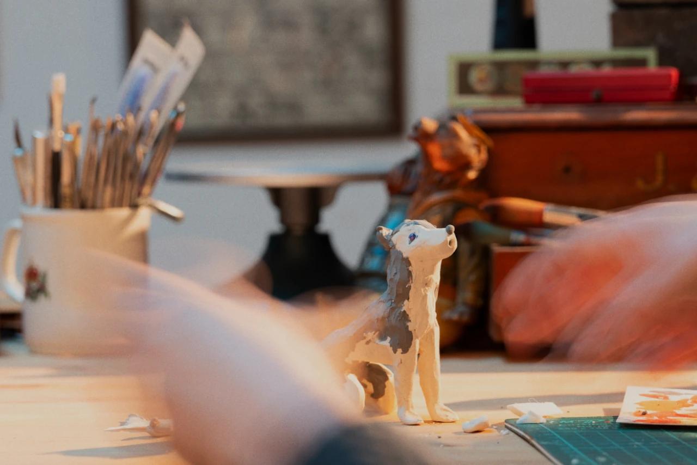

Following the success of the EAD created for the short film *Visible Mending* (Moore 2023), the team was delighted to collaborate once more with MediaActive Projects C.I.C on the film *Follow the Dogs* (Garrett 2024). *Follow the Dogs* is presented by Film Cymru Wales and BFI Network in association with BBC Cymru Wales through Beacons Short Film Fund. We invite you to watch this part-animated documentary on BBC iPlayer with a unique EAD track. You can also let us know what you think by completing this short survey.